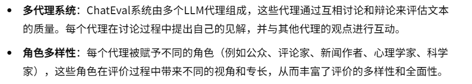
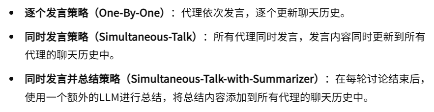
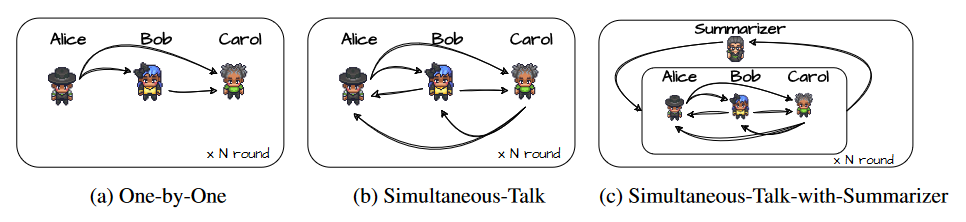
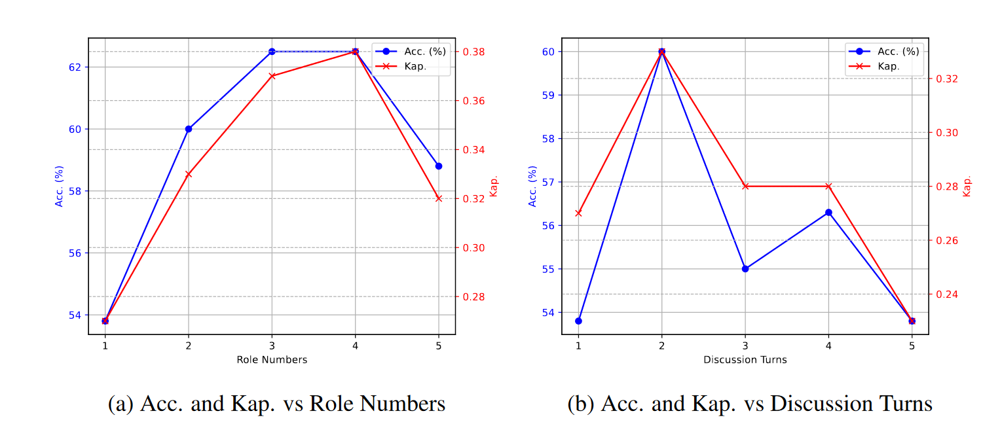

08-CHATEVAL: TOWARDS BETTER LLM-BASED EVALUATORS THROUGH MULTI-AGENT DEBATE

总结：这篇论文提出一个对文本质量评价的Multi-Agent方法，Agents采用辩论的方式进行评价，通过多轮对话的方式，使得模型能够对文本进行更详细的分析，最后由一个总结者进行最终评价。

代码仓库：https://github.com/chanchimin/ChatEval

##### 核心方法：
- 多代理角色：

- 多代理通信策略

##### 实验总结：多轮的对话会导致性能下降，可能是由于上下文对话过长，LLM性能下降。角色过多也会导致性能下降。

##### Prompt设计：
- Assistant 1 的回答
- Assistant 2 的回答
- 系统提示：我们想请求您对两个人工智能助手的性能提供反馈，以回答上面显示的用户问题。请考虑他们的回答的有用性、相关性、准确性和详细程度。每个助手都会获得 1 到 10 分的总体分数，分数越高表示整体表现越好。还有其他几位裁判分配了相同的任务，您有责任与他们讨论并在做出最终判断之前进行批判性思考。
- 历史辩论消息
- ##### 角色描述
- Now it’s your time to talk, please make your talk short and clear, {agent name} !