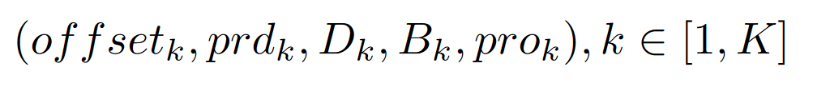
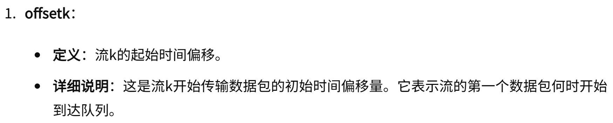
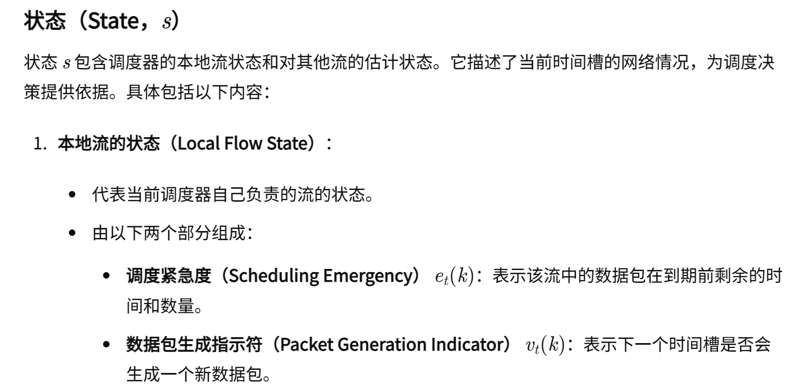
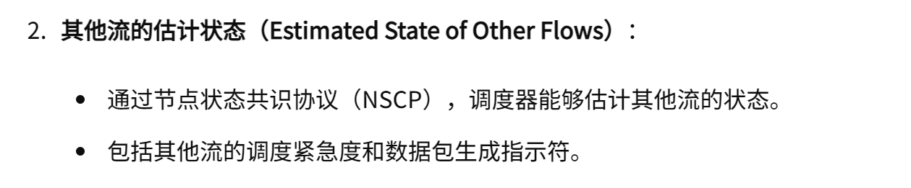
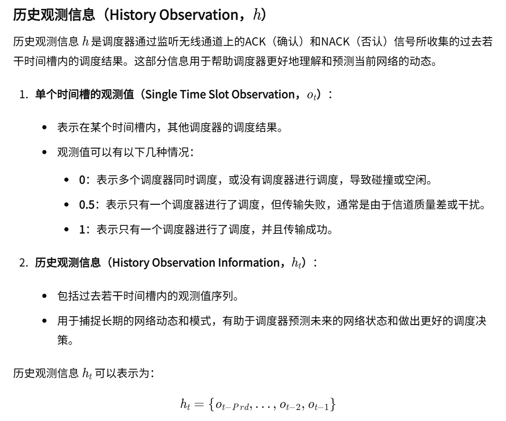
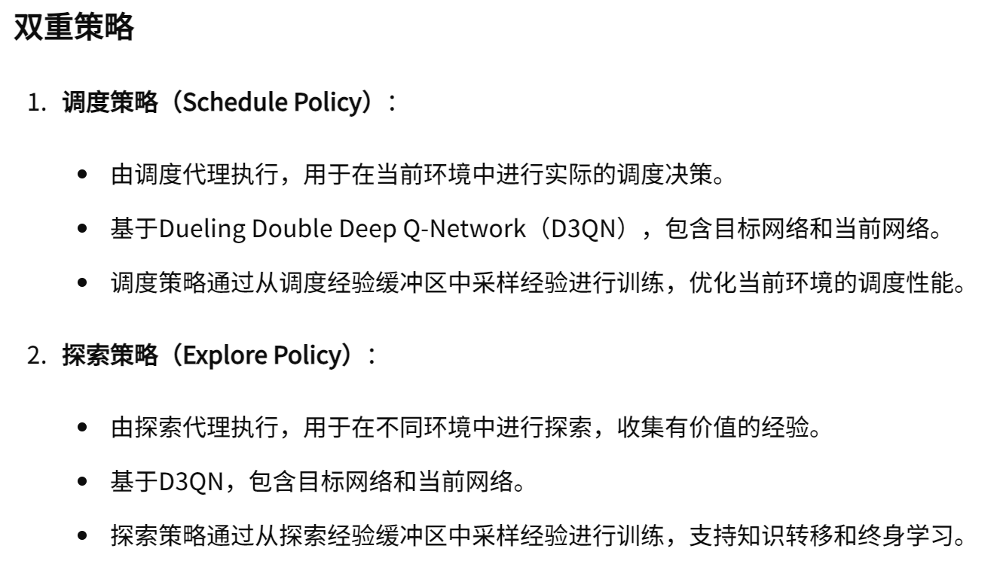
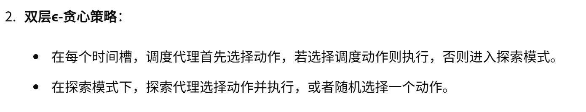
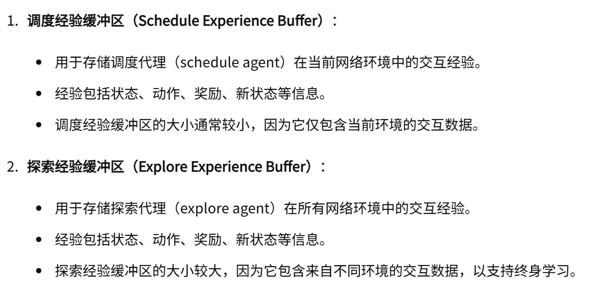
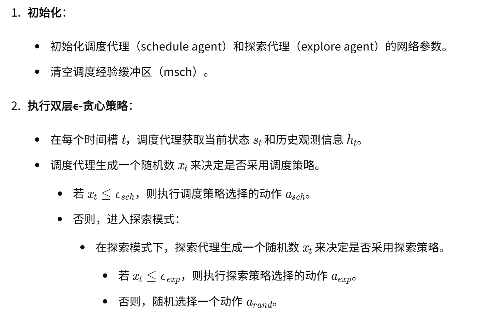

02-Scheduling of Real-time Wireless Flows: A Comparative Study of Centralized and Decentralized Reinforcement Learning Approaches

### 1. 集中式
#### 一、数据流五元组：

#### 二、优化指标：

#### 三、状态与动作

### 2. 分布式
#### 一、Observation (包含 state 和 history)

##### NSCP协议
- 每个结点的流量模型如果改变的话，就会将其广播到所有的结点中。这样每个结点就能够自身模拟出其他结点的发送模式，从而帮助自己决策。因此每个结点的状态除了自己的e和v，还包括其他所有结点的e和v。为了区别每个结点的状态是不同的，每个结点都将自己的ev放在第一个位置。

#### 二、调度策略和探索策略

#### 三、训练流程/算法

