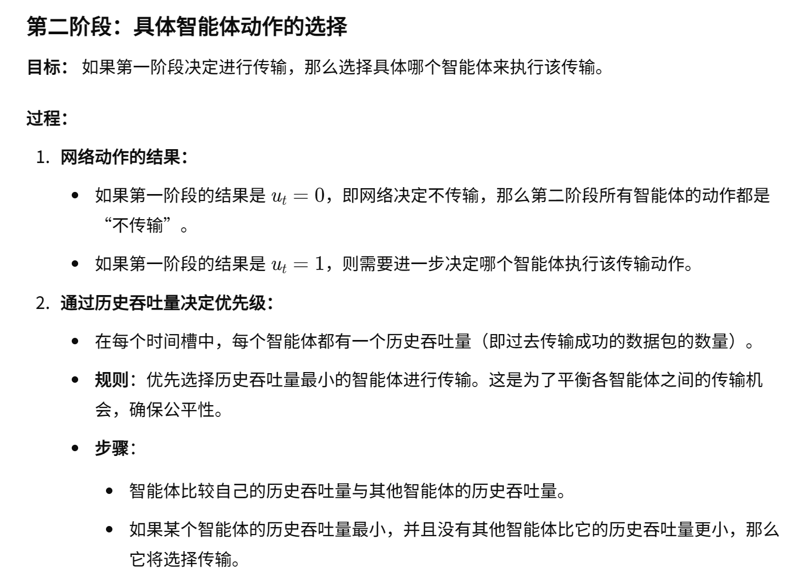
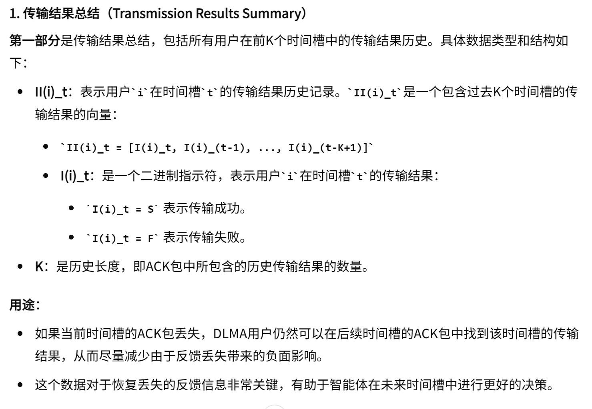
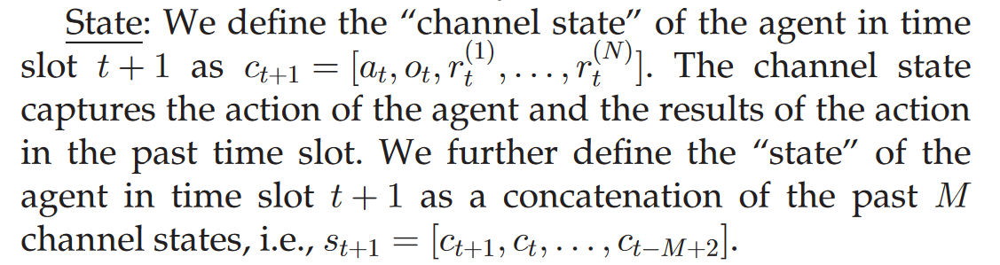

04-Multi-Agent Deep Reinforcement Learning Multiple Access for Heterogeneous Wireless Networks With Imperfect Channels

总结：在该方法中，争抢信道的一共有两种用户：MARL智能体和传统争抢信道MAC协议的用户。信道也是不完善的，有可能会出现发送数据包出现错误、AP返回的ACK帧也有可能出错。出错概率可以自行调整。该方法通常AP每次返回的是K个时隙的ACK信息，让客户端能够根据后续的ACK帧进行修复之前的训练数据。虽然这个方法是完全分布式的MARL，但是在AP的ACK帧中，添加了太多的东西，详见图3。想要实现这些东西，不仅需改大范围改变客户端的MAC协议，还以改变AP。让AP存储时隙信息。

##### 核心方法
- 网络环境
    - 时隙化系统，每一时刻都默认有数据包到达
    - 两种用户类别:
        - MARL智能体：采用多智能体强化学习训练的智能体用户
        - 采用传统MAC协议的用户
        - 这两组用户同时争抢信道
- 两阶段的方法
    - 第一阶段，由DQN的DNN网络输出每个动作的Q值。其实就两个动作，发或不发
    
    
    - 第二阶段
    
    
    - 总结
    
- 强化学习组成要素
    - 状态：如图
        - 上行：做出动作
            - It的含义
            
        - 下行：AP给出ACK，对ACK进行介绍
            
            - 四种数据的解释：
            
            
            
            
        - 根据以上信息该方法的状态设计
        
    
    - 动作
    
    - 奖励
    
- 智能体的训练

##### DRL + MAC 的相关工作
- 除了[2]、[3]之外，还有其他关于基于DRL的MAC的工作。与[2]、[3]一样，[17]、[18]、[19]、[20]、[21]、[22]中的研究也假设物理信道是完美的，并且没有处理方案渠道不完善。 [17]、[18]、[19]、[20]、[21]、[22]与我们当前工作之间的其他细微差别将在下面详细说明。