05-Effective Multi-User Delay-Constrained Scheduling with Deep Recurrent Reinforcement Learning

总结：这篇文章介绍一种固定路径多跳的路由调度算法。

#### 符号解释
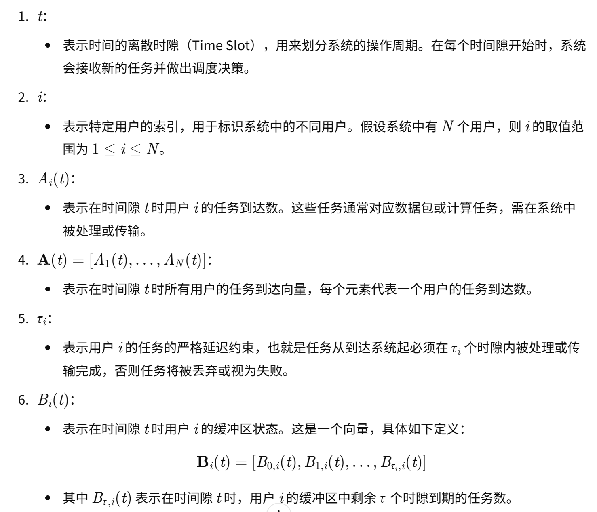
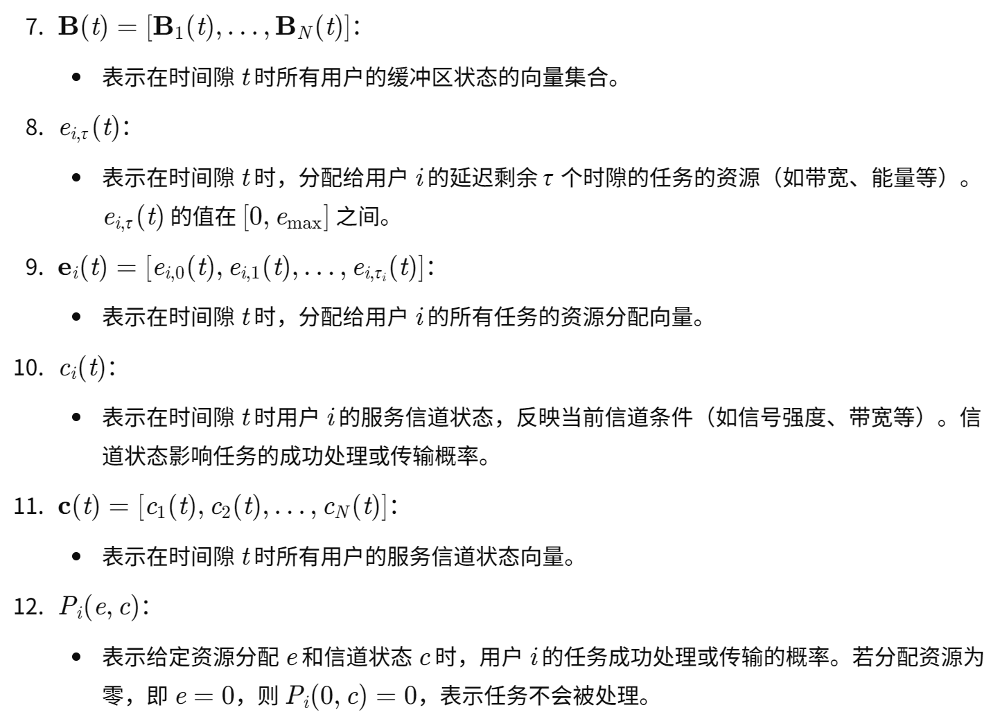
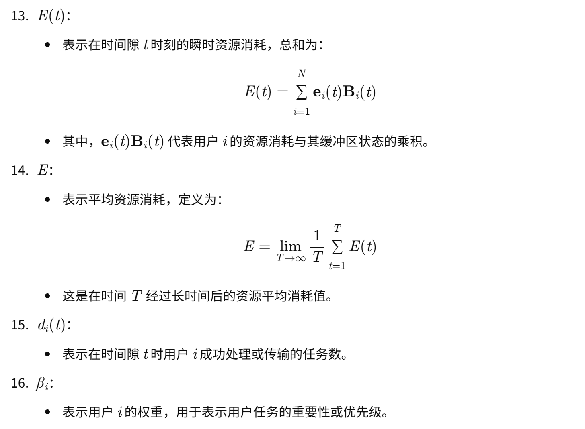
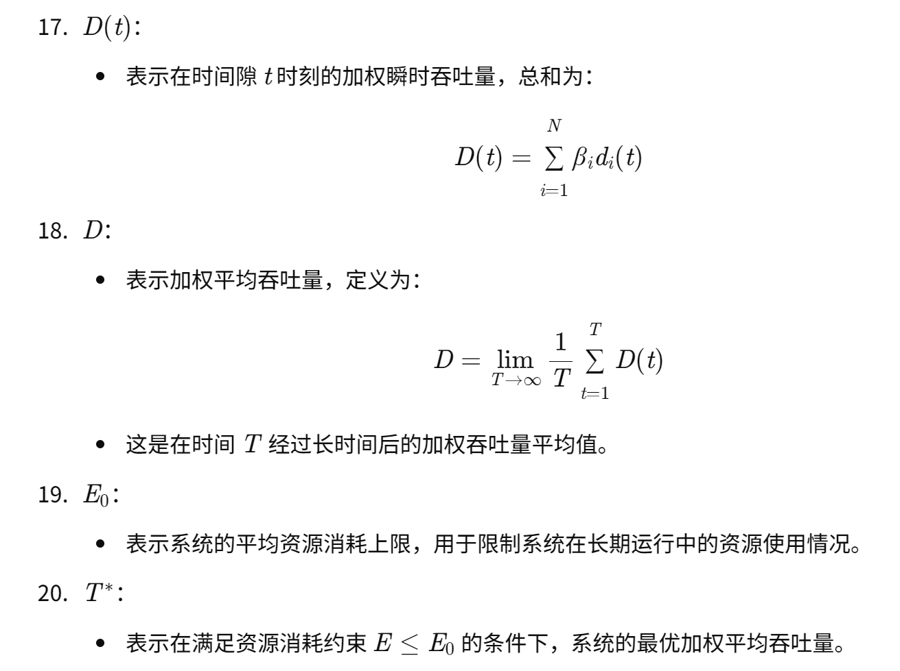

#### 核心算法-单跳
- 下图为单跳网络拓扑。一共有N个数据流，每个数据流分别对应交付的N个用户
- 同时发送不会产生冲突
- 状态
    - B和C的含义看 符号解释
    - 为了统一每个用户状态数据的维度，将a转换为b
    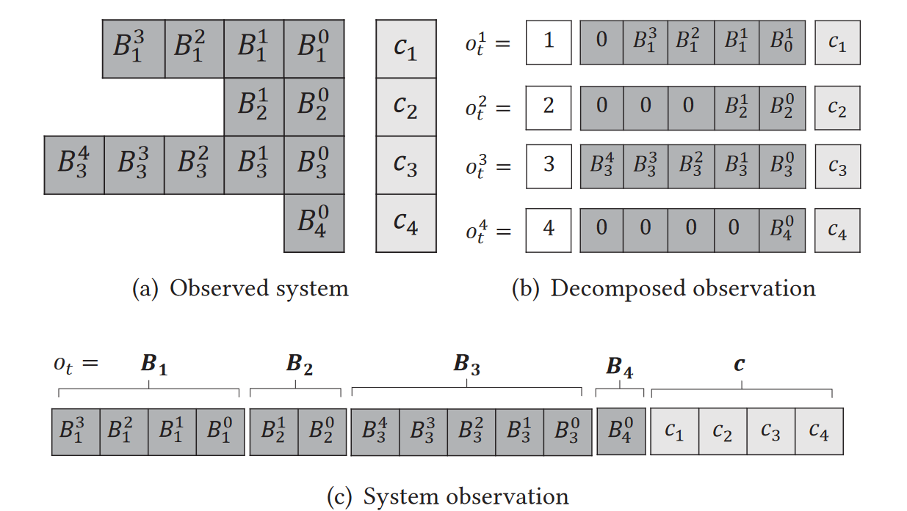
- 训练：全局只训练一个智能体
- 动作输出是 e 详见上面9 ，表示资源分配。e 直接影响 P 传输成功概率。
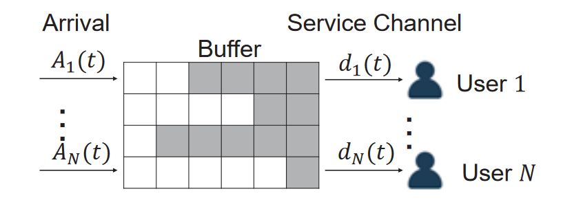

#### 核心算法-多跳
- 例：一共有三条数据流，每个流的起点都有数据包到达。数据包需要交付到每个流的终点。
    - 算法要做的就是给每个路径的每个节点进行资源 e 的分配。
    - 状态见下图
    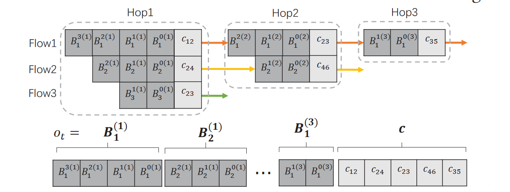
    - 状态的解释
    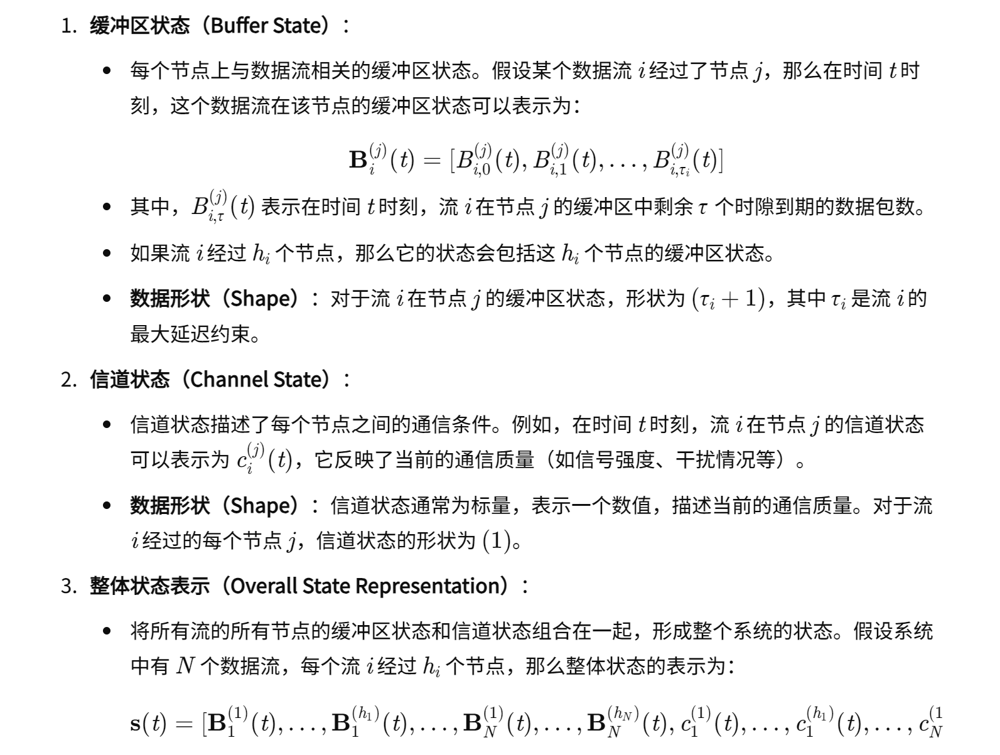
    - 动作
    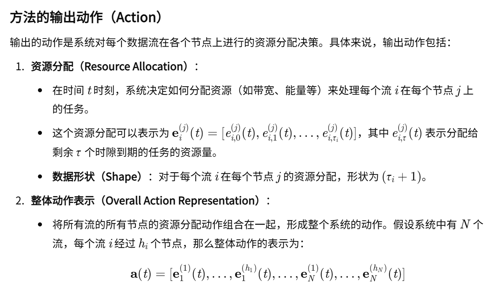
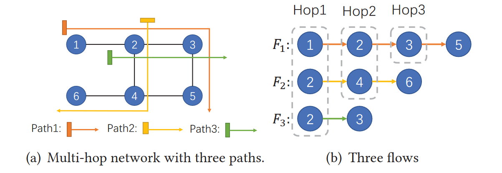

#### LSTM的使用和算法伪码
- 如下图，这篇文章采用两个输入处理分支。有一个分支是LSTM网络
    - 文中没有明确提到LSTM的输入内容。但是在算法伪码的第10行，有一个ht的历史信息
    - 猜测，LSTM会输入这些历史信息。
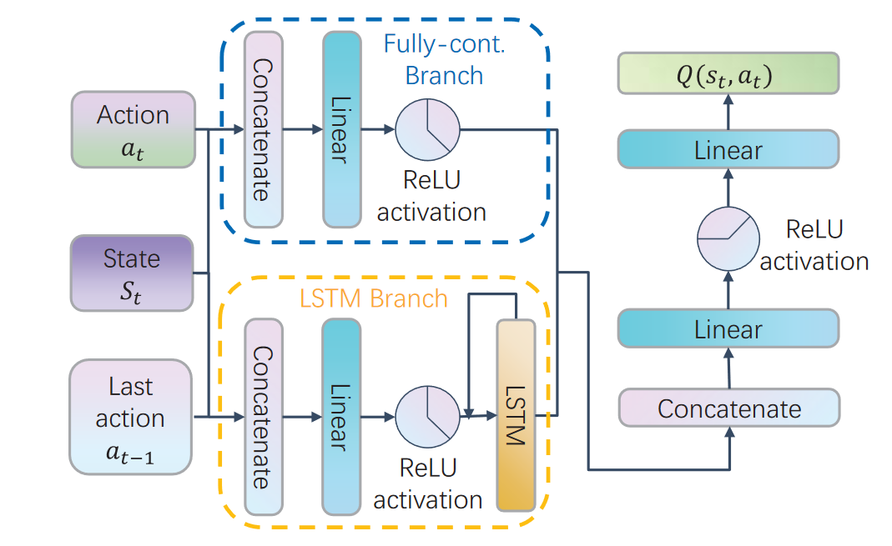
- 伪码
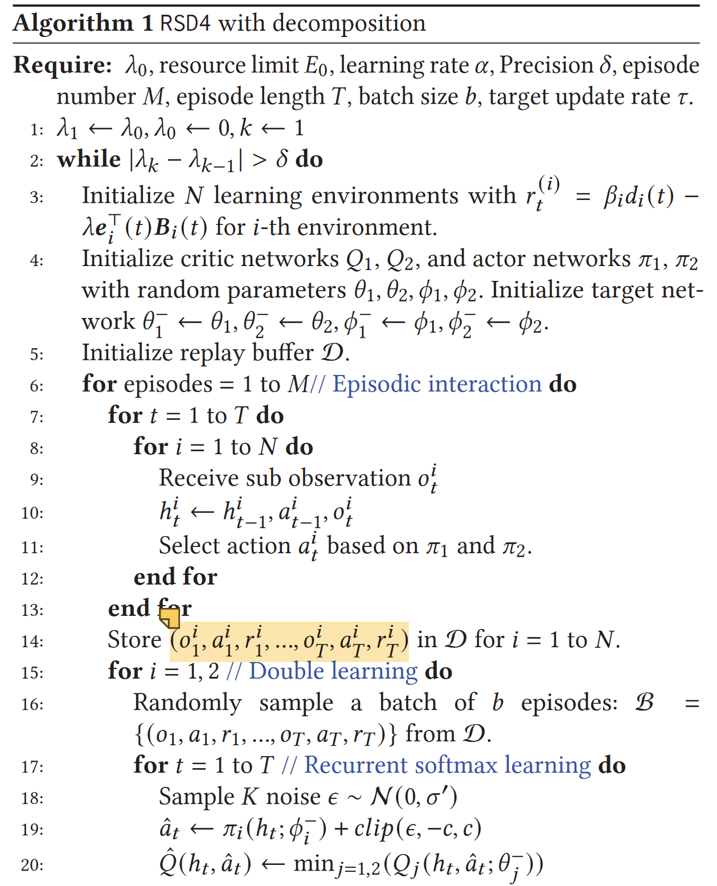
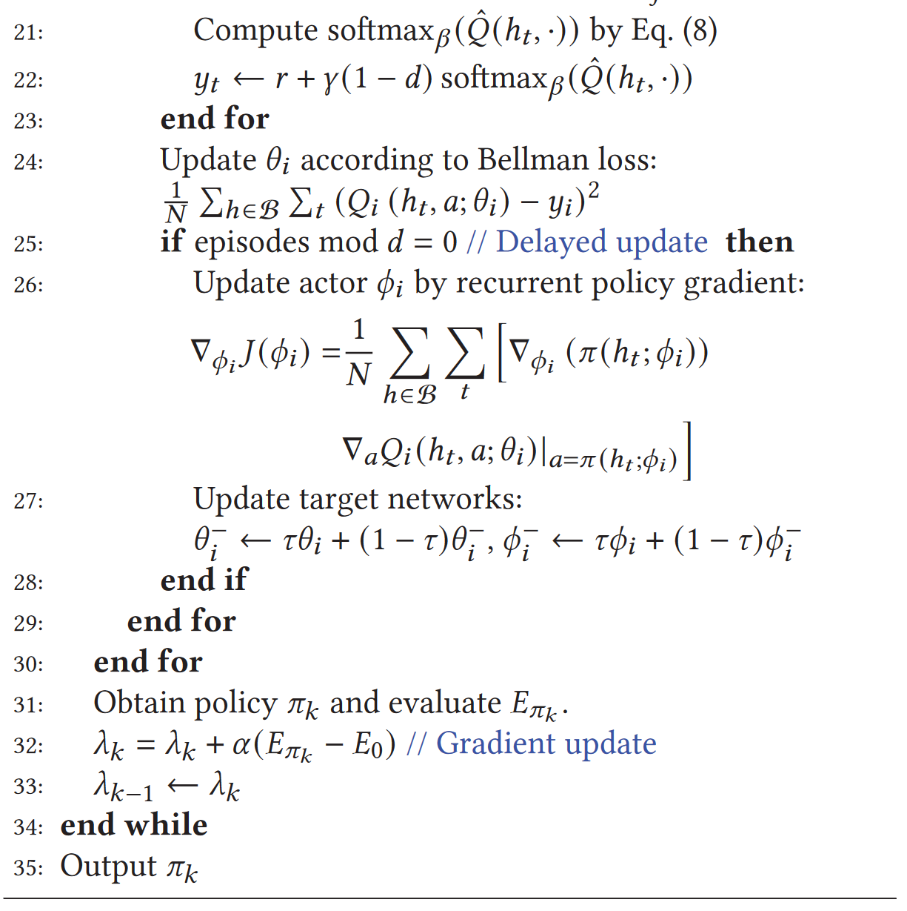

#### 单跳训练方式
- 这篇文章应对用户数量增长可变的方法是：将每个用户的状态统一到一个向量长度。然后全局只采用一个RL算法，用所有用户的数据训练这个RL算法，在训练结束后，将RL算法下发给用户。每次训练的状态，在开头都会加一个id，表示这个用户。
- 状态表示图
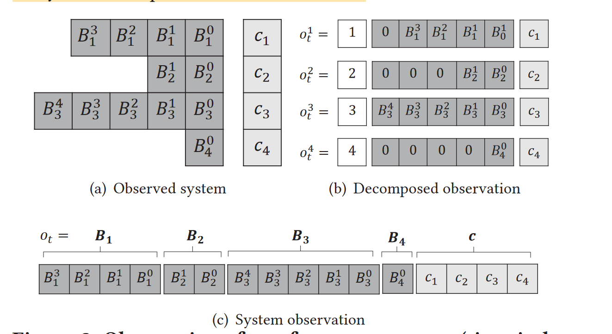

#### 对比实验：
- 我们将 RSD4 与现有 DRL 算法和经典非 DRL 方法的性能进行比较。基准 DRL 算法包括 Twin Delayed DDPG (TD3) [6] 和 Softmax DDPG (SD3) [22]，两者都是最先进的算法。我们将它们与拉格朗日对偶一起应用以确保平均资源限制。非 DRL 算法包括编程、统一和最早截止时间优先 (EDF) [5]

#### 消融实验：
- 主要对比几种限制场景，修改可观察的状态 o，主要对比的是强化学习算法的优势。

#### Related Work
- 许多现有的工作已经研究了调度问题。在采用的众多技术中，有四种方法受到了广泛关注，包括基于排队论的方法，例如[11, 26]，基于优化的方法，例如[10, 13]，基于动态规划的控制，例如[3, 28]，基于 Lyapunov 的优化，例如 [16, 23]。然而，这些方法要么没有明确捕获延迟约束，要么需要精确的系统动力学，这在实际系统中可能非常重要。此外，基于DP的算法经常受到维数灾难的困扰，并且无法扩展到大规模场景。 DRL由于其通用性和可扩展性，在调度领域受到了广泛关注，并已被应用于多种调度场景，例如视频流[18]、多路径TCP控制[34]、网络可重构性[2]、MAC调度[20]和资源受限调度，例如[7,19,21,31]。然而，上述工作要么不能确保平均资源约束，要么需要完美可观察的系统状态作为输入。此外，他们没有考虑大规模或多跳系统

#### 数据流量模型
- 数据包到达模式：不同用户的到达情况由LTE数据集给出[15]，该数据集记录了移动运营商4G LTE网络大约一年内的流量。我们构建了一个具有 LTE 数据集给出的四种到达类型的环境，如图 7(a) 所示。所选数据记录的特征如表1所示，根据速率和延迟要求模拟了文件传输、在线论坛、VR游戏和文本通信四种代表性任务。
    - Naebolo_Khanh Loi. 2018. Predict traffic of LTE network | Kaggle. https://www.kaggle.com/naebolo/predict-traffic-of-lte-network. Accessed: 202107.
- 信道质量：信道状态由无线 2.4GHz 数据集[30]给出，该数据集对深圳宝安国际机场值机大厅的接收信号强度指示器（RSSI）进行采样。每个通道状态被量化为 4 个状态，每个状态代表一个 RSSI 级别，如图 7(b) 所示，其平均通道状态在表 1 中给出。
    - Wang Taotao, Xin Jiantao, Xu Wensen, Cai Yucheng, and Zhang Shengli. 2021. Wireless signal strength on 2.4GHz (WSS24) dataset. https://github.com/ postman511/Wireless-Signal-Strength-on-2.4GHz-WSS24-dataset. [Online; accessed 17-2-2022]. 