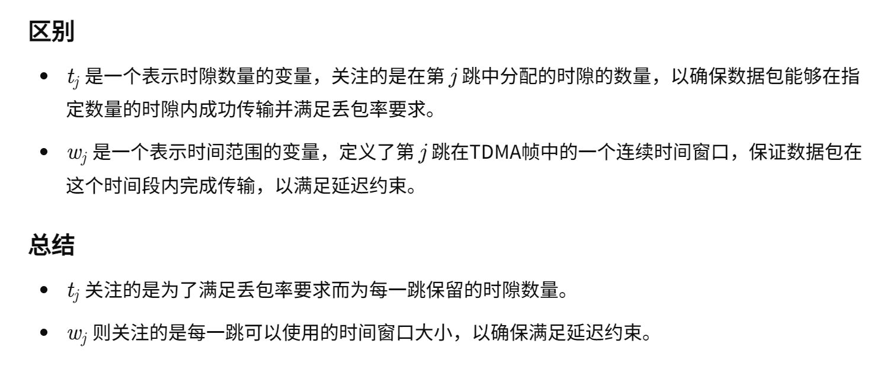

06-Transmission of Real-time Traffic in TDMA Multi-hop Wireless Ad-hoc Networks

总结：这篇论文是通过优化多跳路由中的每个节点资源分配进行多跳QoS优化。采用数学的方法。

#### 核心方法：
- 分配资源 t 和 w

- 计算方法

- 路由指标优化

#### Related Work
- 深入研究了多跳无线网络中保证QoS的实时流量传输的资源分配问题。在[4]中提出了TDMA无线网状网络中保证延迟的实时流量传输问题。作者通过联合优化路由和调度来最大限度地减少对延迟约束的违反。然而，由于考虑了理想链路，因此没有研究语音流的 PLR 约束。类似地，在[5][6][7]中，仅考虑实时流量的延迟约束，假设链路的传递概率等于1，但在实际无线电环境中通常不是这种情况。
- 在[10]中，作者研究了具有固定保留周期的MDA，并开发了自适应资源分配技术，以满足考虑实际无线电环境的QoS约束。然而，作者没有考虑通过多跳路由进行语音传输，这在无线网状网络中通常是这种情况。