07-Online Packet Scheduling with Hard Deadlines in Multihop Communication Networks

总结：这篇文章是关于路由多跳调度的。多条路径事先固定，每个数据包选择一条进行数据传输。传统数学方法。一个值得学习的点是，它会在数据包到达的时候，判断是否接收数据包。如果认为若要接收该数据包，会影响已有数据包发送，代价过大。则可以选择不接收该数据包。

#### 核心方法
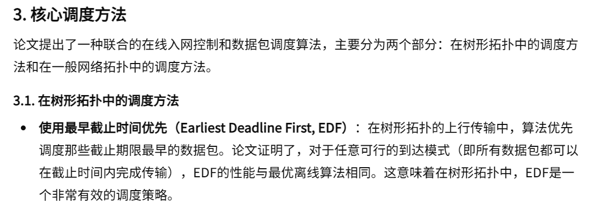
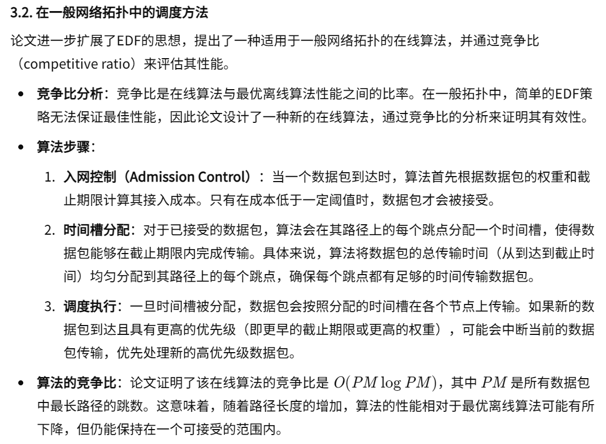
- 在一般网络拓扑中的调度方法---多跳调度的细节
    - 问题背景、数据包模型
    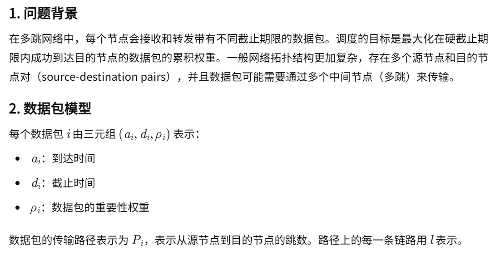
    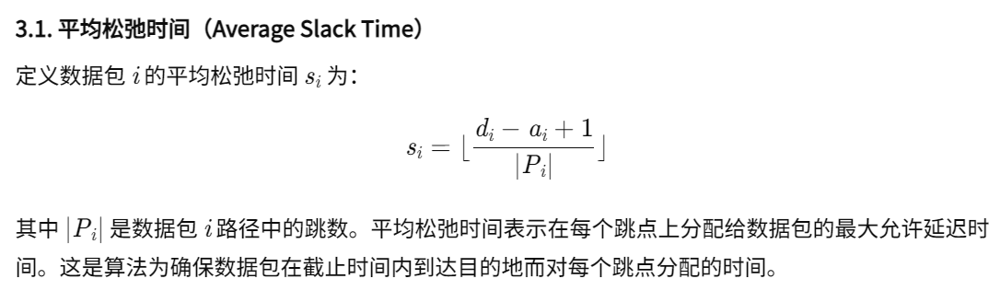
    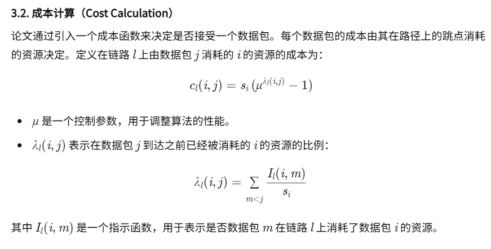
    - 入网控制
    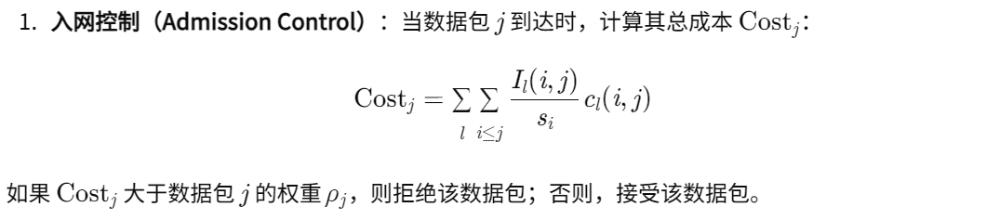
    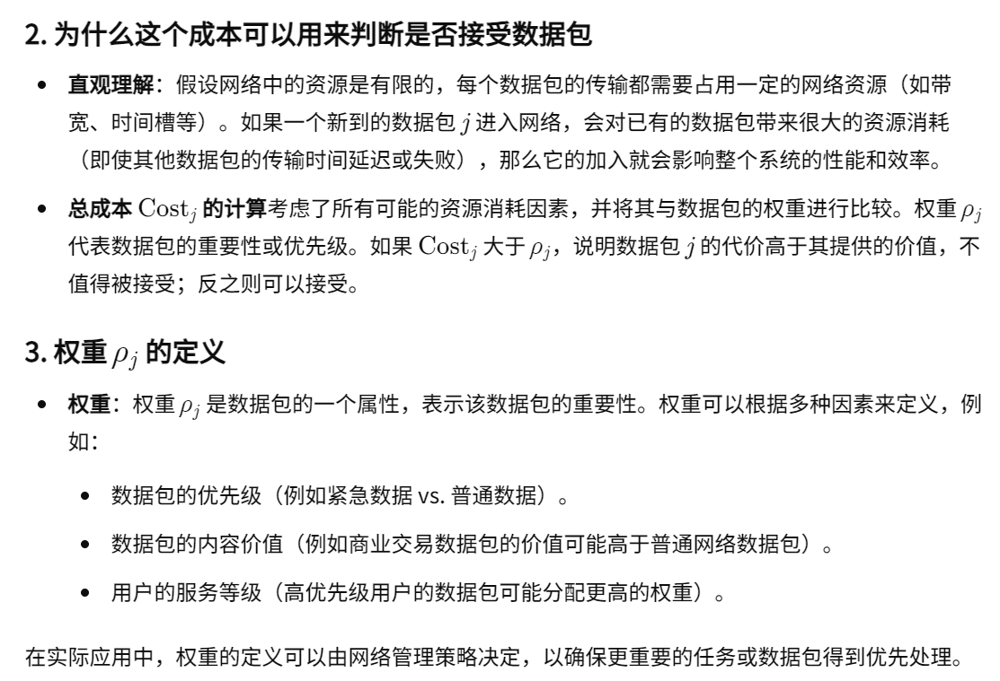
    - 时间槽分配
    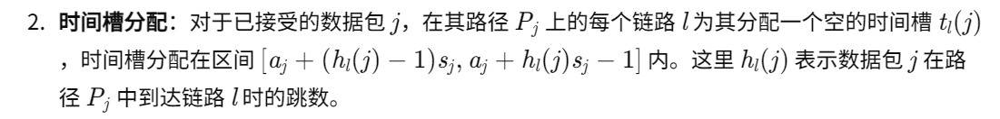
    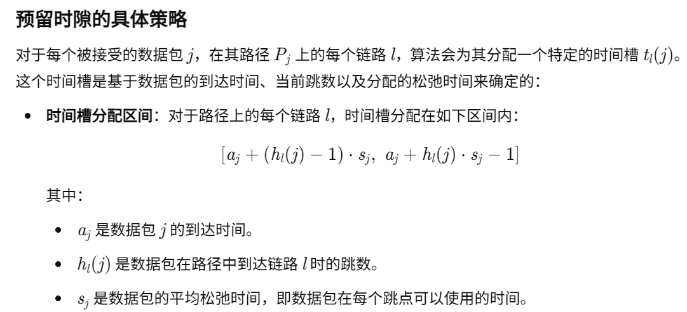
    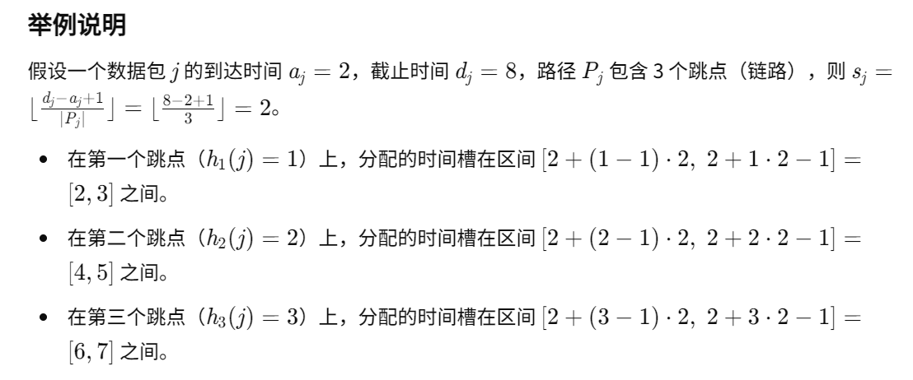
    - 调度执行
    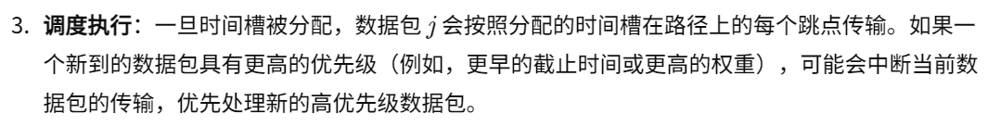

#### 符号解释
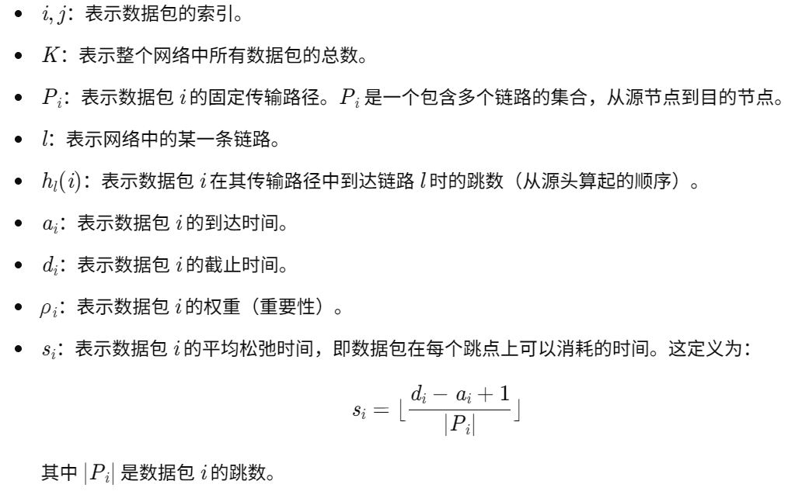
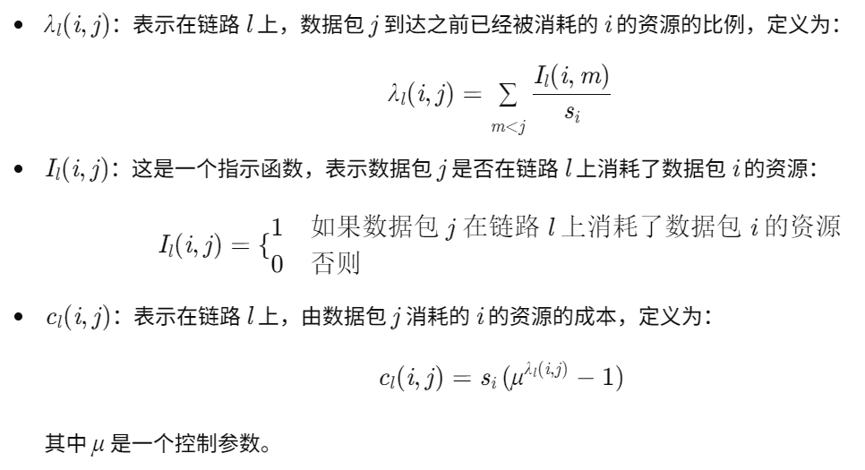

#### 网络环境
- 多跳，但是路径固定
- 数据包模型
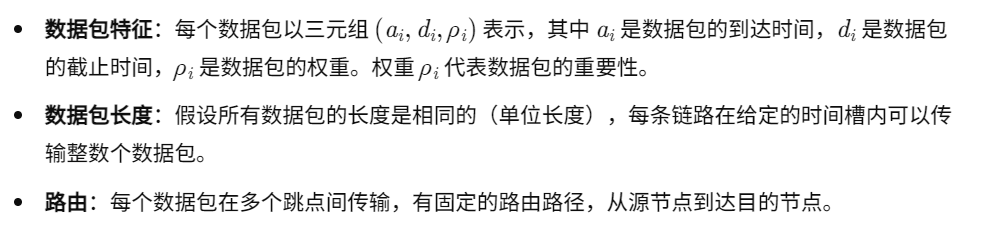
- 没有明确说明数据包到达模式

#### 文章可借鉴的思路
- 我们不一定要做完全的端到端调度决策。可以在RL算法决策之前，先用一种算法事先剔除一些数据。