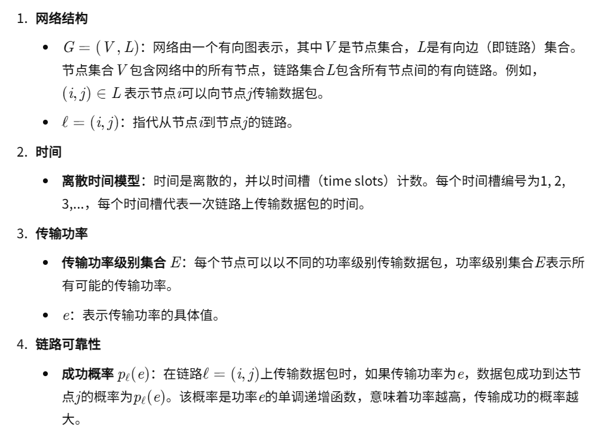
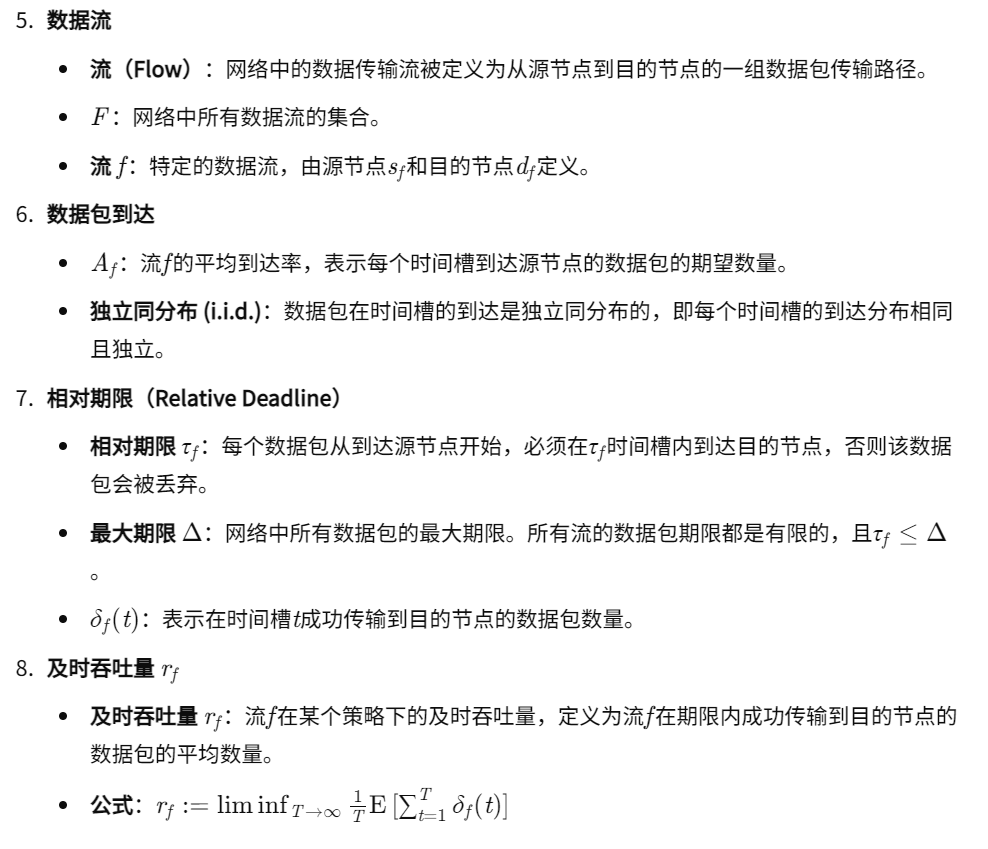
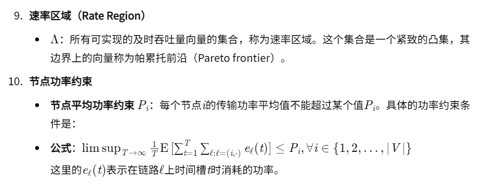
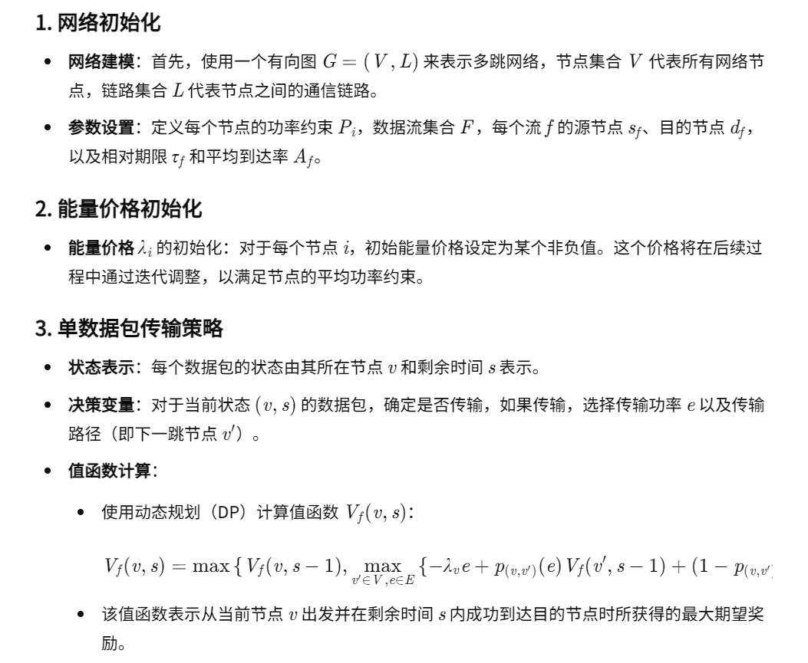
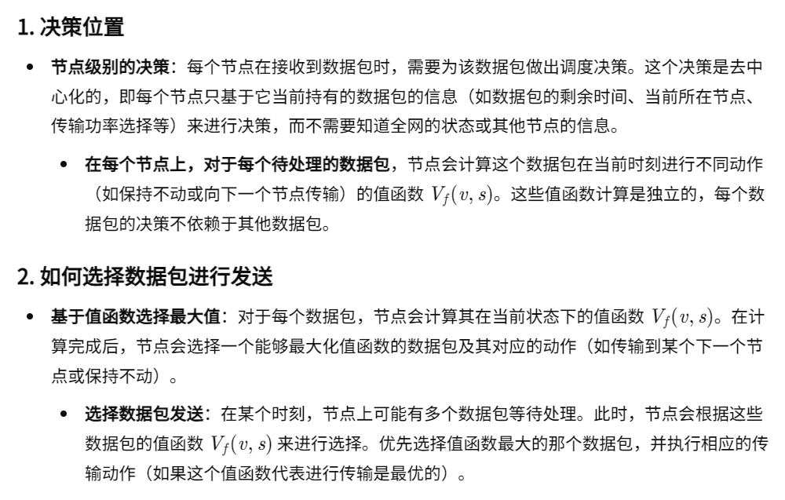
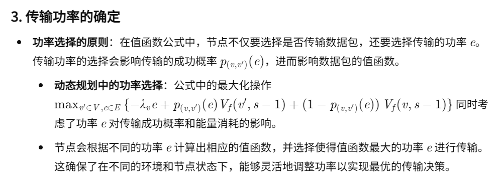
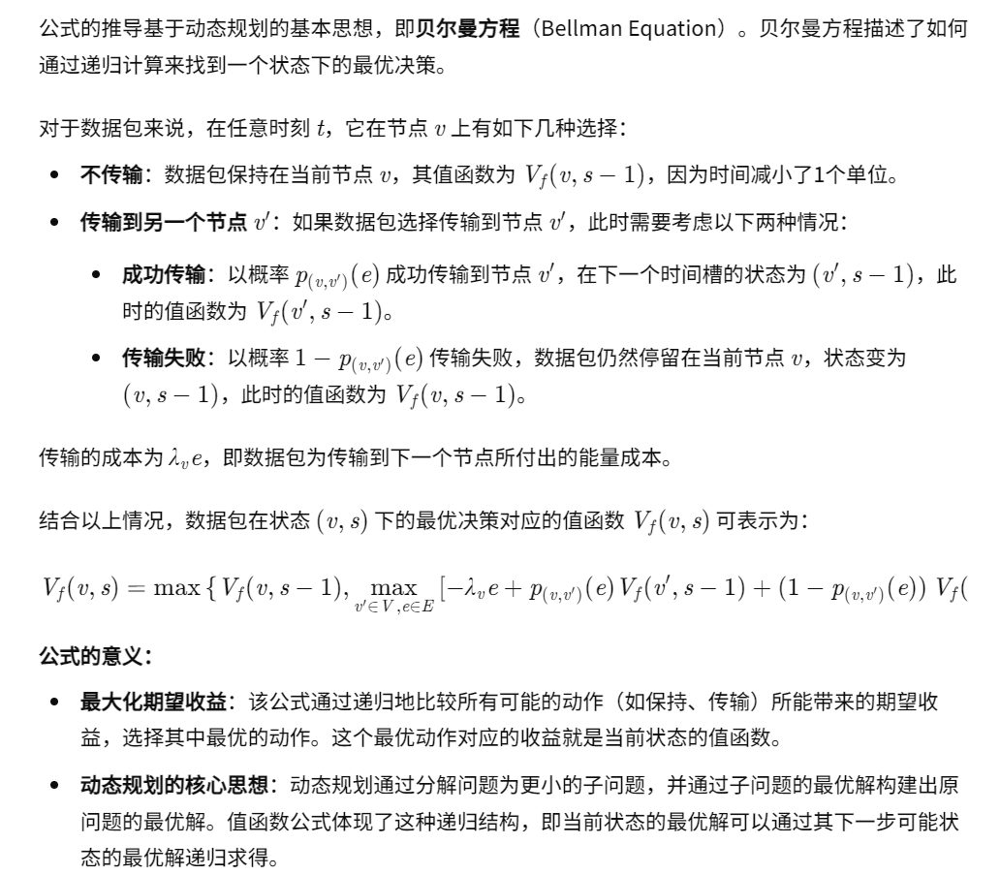

08-Throughput Optimal Decentralized Scheduling of Multihop Networks With End-to-End Deadline Constraints: Unreliable Links

总结：在多条多跳的数据流上进行数据包调度。分配的是功率，传输成功率和分配的功率正相关。

#### 网络环境

#### 核心方法

- 公式详解
