01-Deep Multi-User Reinforcement Learning for Distributed Dynamic Spectrum Access

总结：这篇论文实现的是一种多用户多信道接入的RL算法。一共有N个用户和K个信道，通常N>K。全局只维护一个RL算法，每次更新模型都会同步到其他用户。通俗易懂的说就是，所有用户的数据全部用来训练一个RL算法，最终再分布式执行。

#### RL元素
- 状态：
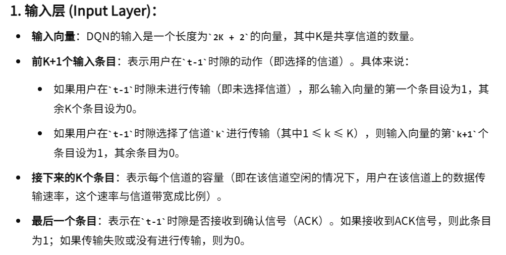
- 动作
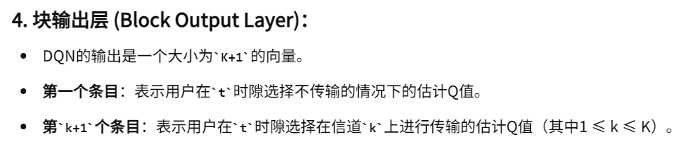
- 历史信息的利用
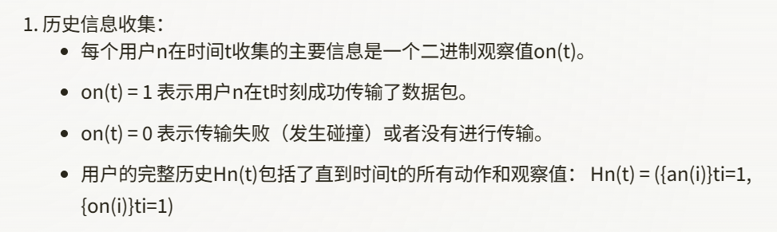
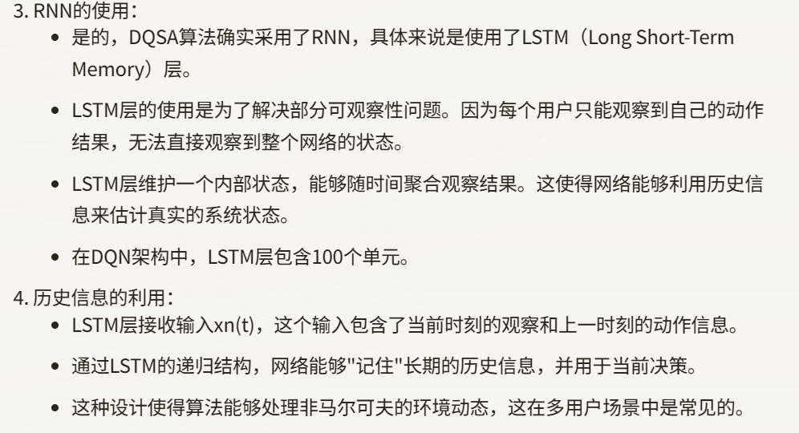
- DQN模型改进
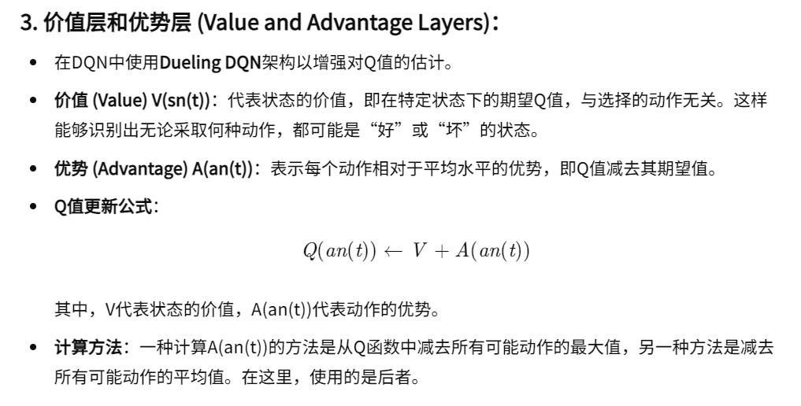
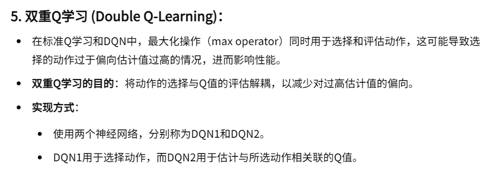

#### 奖励：
- 竞争性奖励
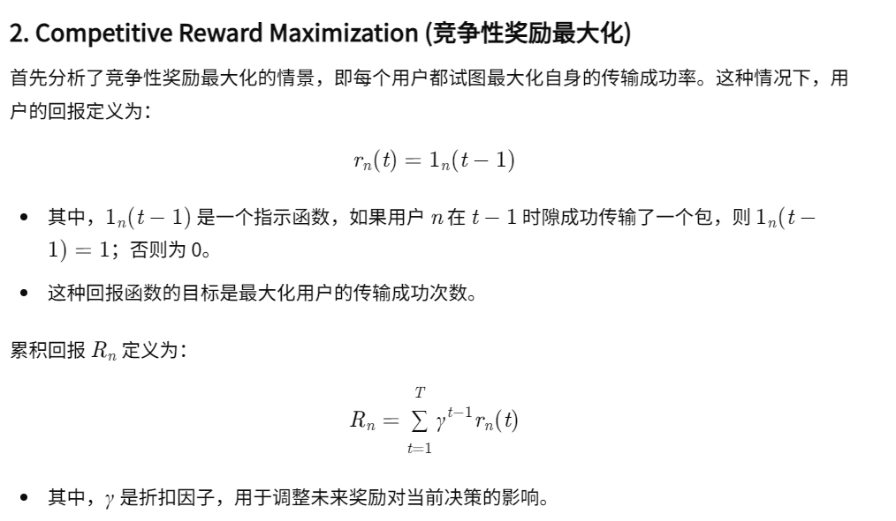
- 合作性奖励
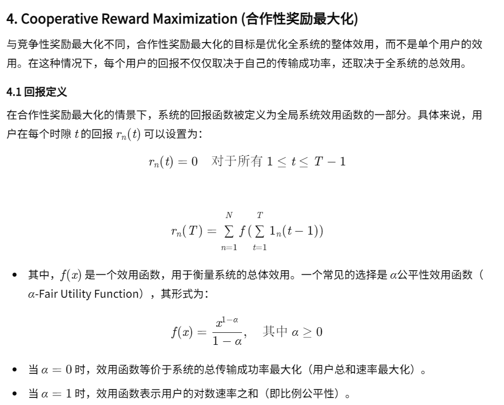
- 聚合奖励---基于合作性奖励改进
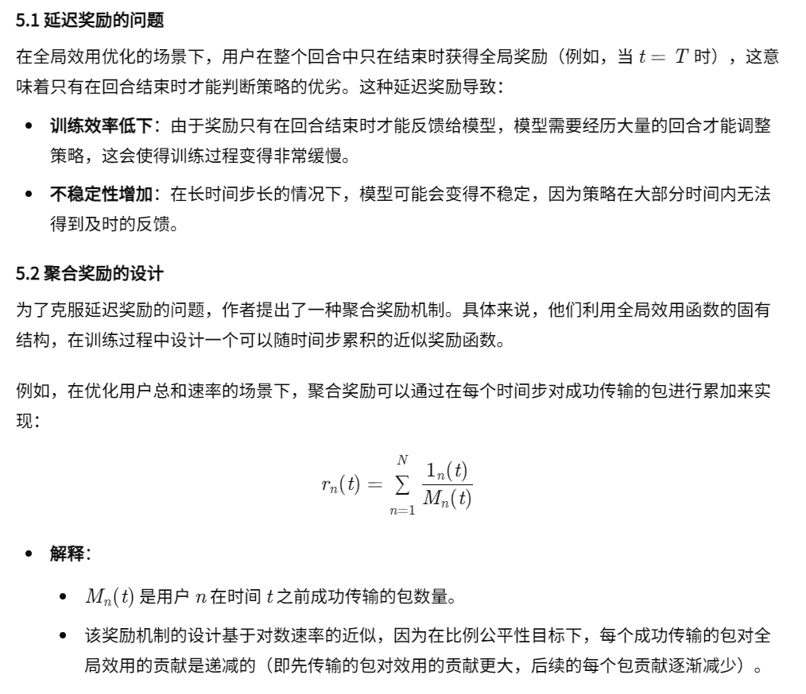

#### 选择动作是Softmax函数的改进
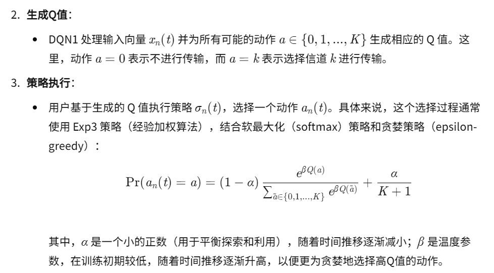

#### 共同训练---全局只有维护一个模型
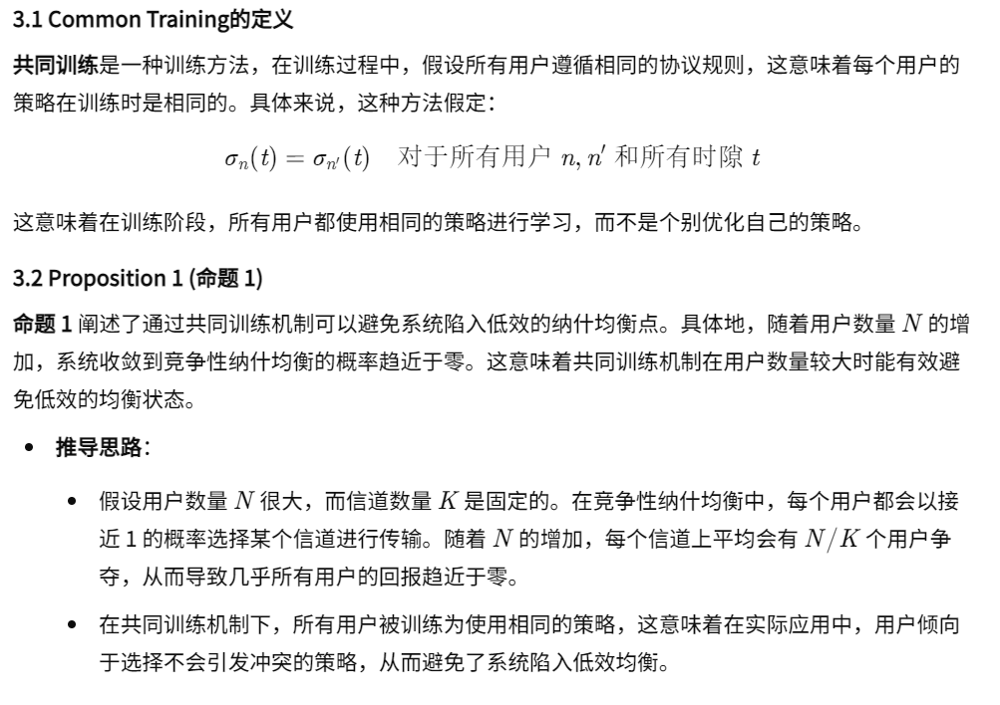

#### 对比实验
- 除了DQSA算法之外，我们还模拟了以下算法进行比较：（i）机会信道感知（OCA）协议，该协议使用信道状态信息来利用信道多样性并以最高可实现速率访问信道（不考虑冲突率） [36]、[57]； (ii) 分布式协议（DP），在选择通道和传输概率时使用吉布斯采样器的分布式学习来收敛到（接近）最优的比例公平速率[58]。

#### Related Workd
- 对无线通信的需求不断增长以及频谱稀缺，引发了针对新兴无线网络技术的高效动态频谱接入（DSA）方案的开发。有关媒体访问控制 (MAC) 设计的各种 DSA 模型的详细概述可以在 [2] 中找到。
- 开发用于管理用户之间高效频谱访问的分布式优化和学习算法在过去和近年来引起了广泛关注（有关相关工作的详细讨论，请参阅第 II-B 节）。