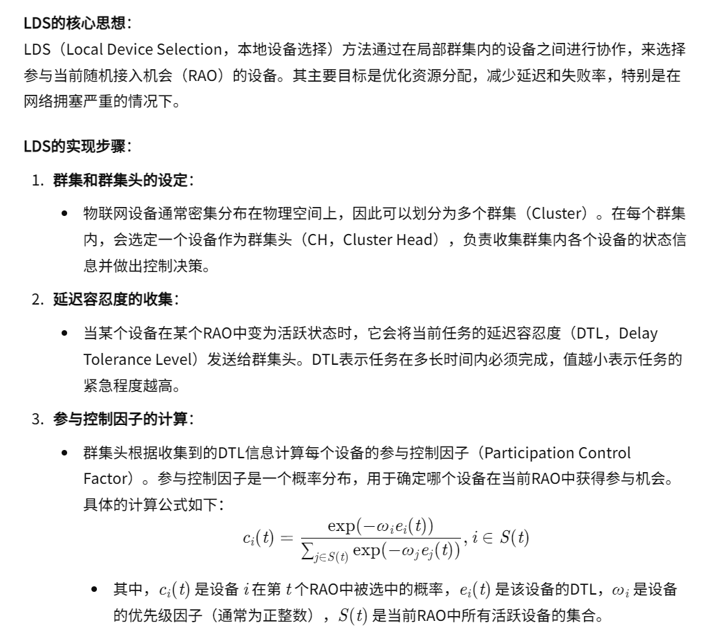
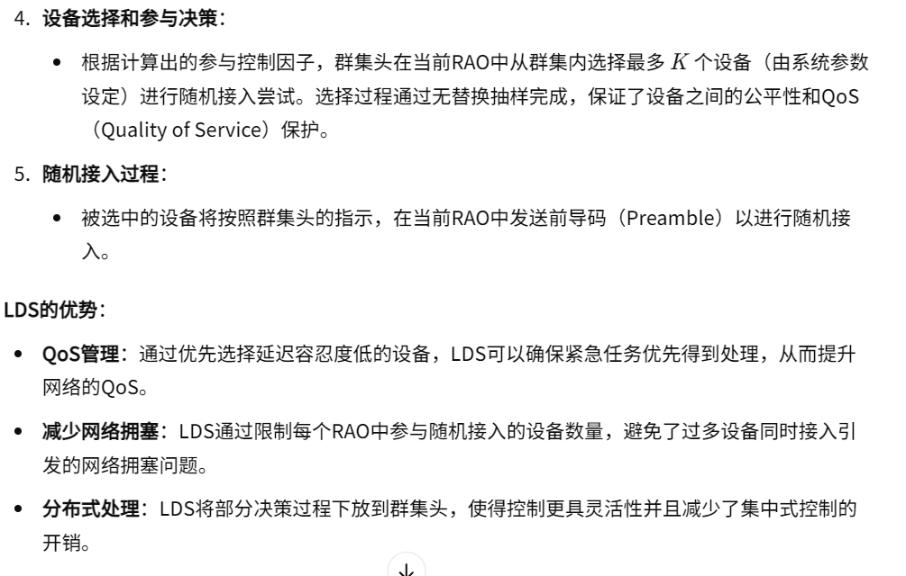
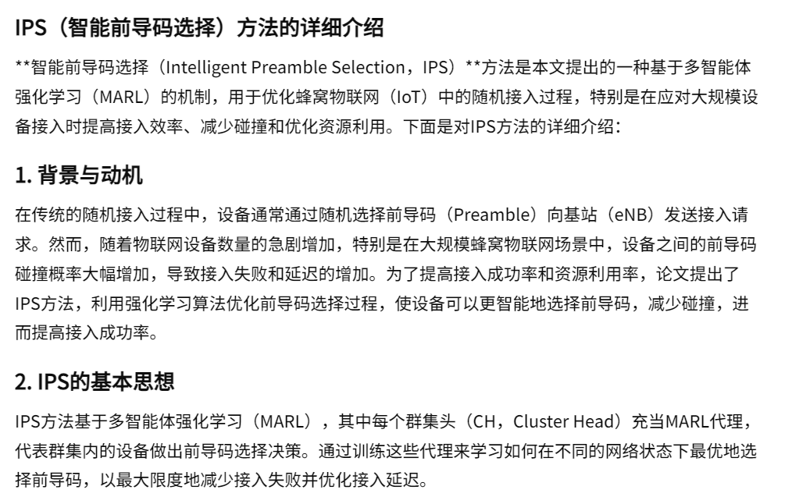
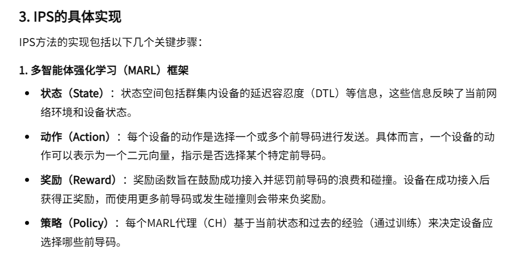
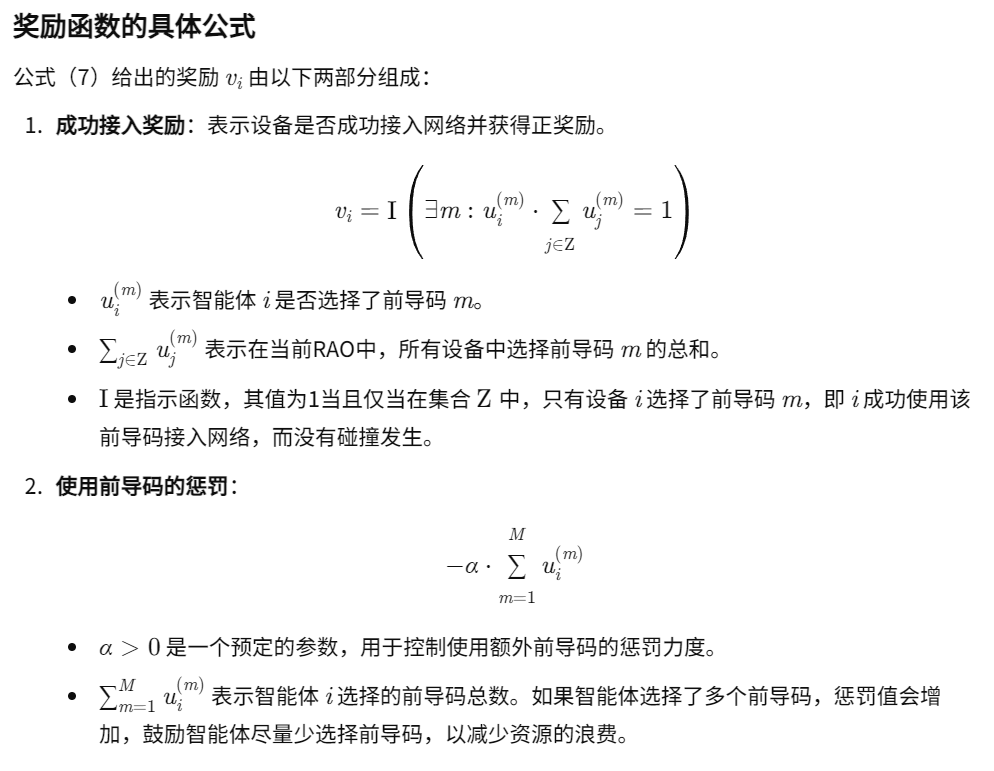
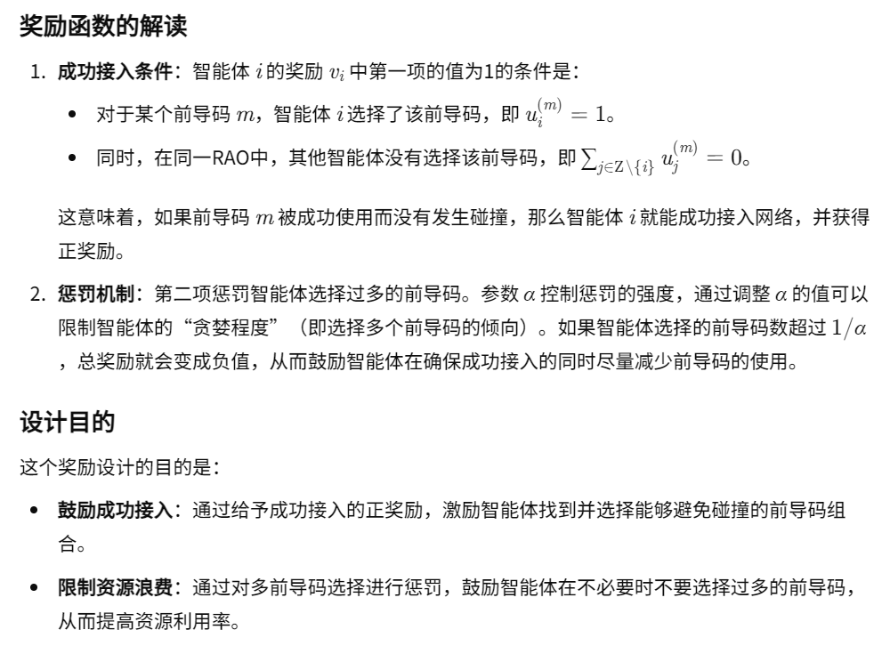
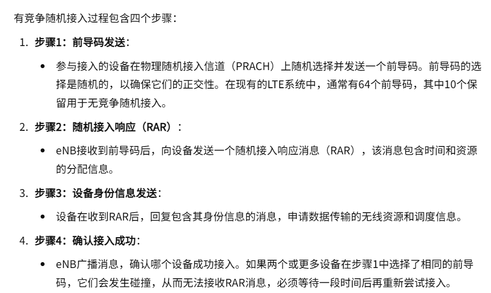
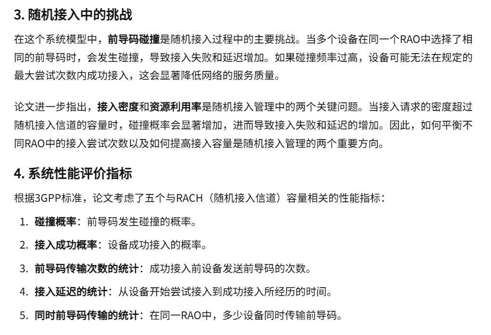
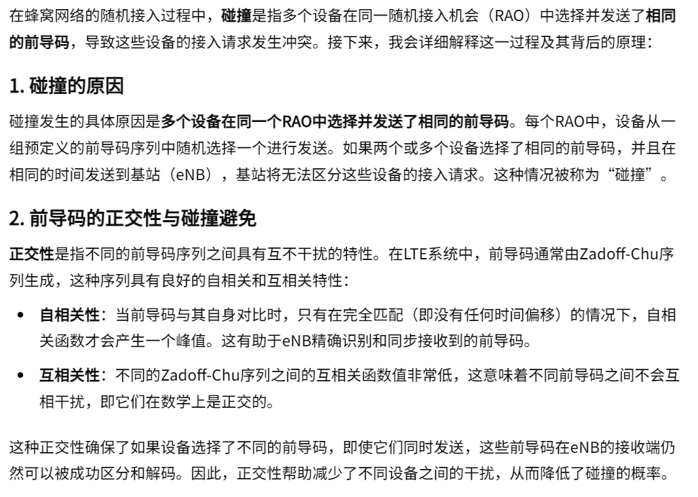

02-Multiagent Reinforcement Learning Meets Random Access in Massive Cellular Internet of Things

总结：这篇文章是关于在IOT移动网络中接入问题。它将用户分为多个集群，每个集群有一个集群头，用来收集集群内部的信息。一共有两个方法DTL和IPS。

#### DTL核心方法
- 在每个集群里面，收集每个用户的延迟容忍度指标和优先级，通过计算，选择前K个用户有发送权。

#### IPS核心方法
- 一个环境内有多个集群，每个集群的集群头作为一个Agent。MARL是在集群之间的优化。
- 每个Agent决策的是在当前时刻，该集群能够使用的前导码。

- 奖励机制：
    
    

#### 网络环境

#### 解决协调
- 我们注意到，在集群层面，我们基本上采用了独立 MARL 设置，即每个代理独立做出决策，而忽略所有其他代理的存在。实际上，这可能会使环境变得不稳定。为了应对这一挑战，我们已经做了很多努力，如实现代理之间的通信 [39]、引入对手学习意识 [40] 或对联合价值函数进行适当因式分解 [41]等等。然而，这些方法需要代理间通信或集中训练，这就限制了它们在实际通信系统中的应用，尤其是在我们感兴趣的随机接入场景中。虽然独立 MARL 设置不可避免地会导致次优化，但我们在部署上的限制极少。