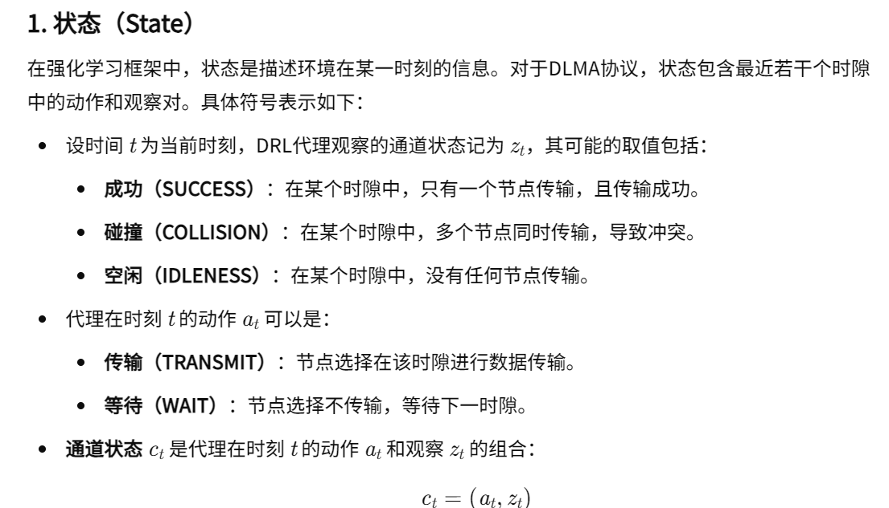
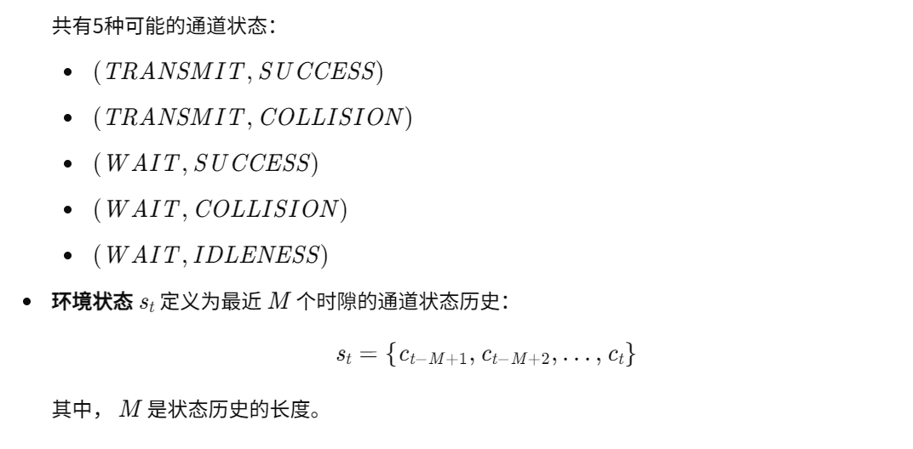
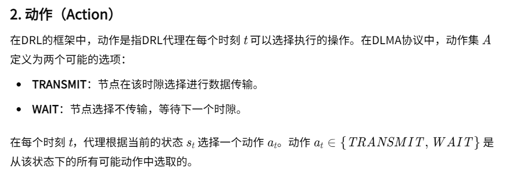
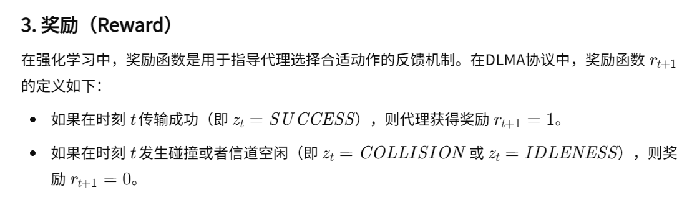

03-Deep-Reinforcement Learning Multiple Access for Heterogeneous Wireless Networks

总结：这篇文章设计的是关于异构无线网络中分布式接入问题。有两种异构网络：TDMA和ALOHA。DRL算法和这两种协议进行争抢信道。这是一种分布式的方法，只利用M长度的历史信息进行决策。但方法比较简单。在实验环节，设计的节点数也是比较少的。

#### 核心方法
- 状态：

- 动作：

- 奖励：
