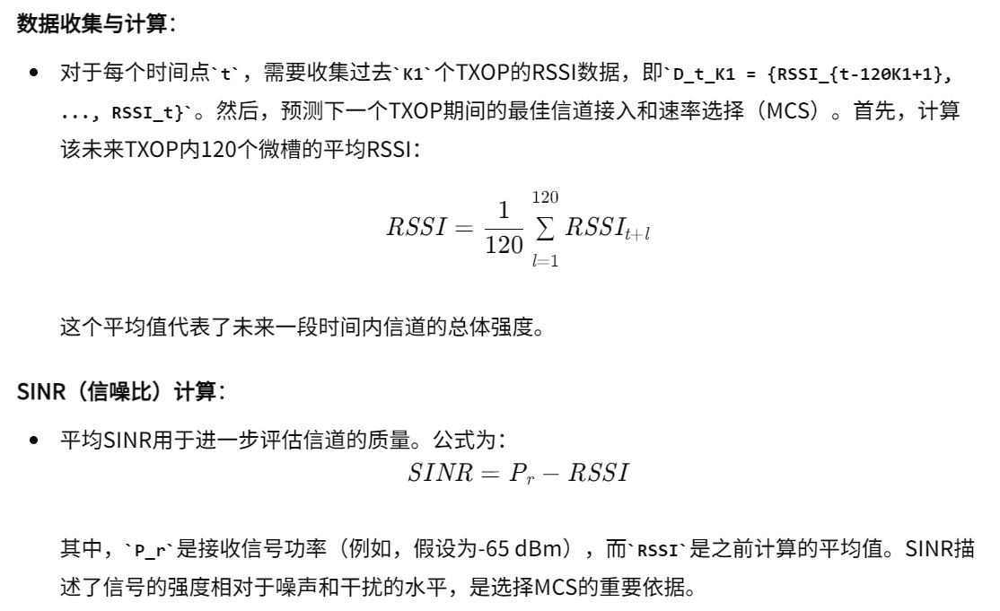

05-A deep-learning-based MAC for integrating channel access, rate adaptation and channel switch

总结：这篇论文实现信道接入和速率控制，信道切换。但是都是监督学习的方法。一开始作者采集了一系列数据，通过输入前K个数据，然后根据后K个数据计算出前K个数据应该选择什么样的速率调制、信道和是否应该接入。从而实现一种监督学习。

#### 核心方法：
- 信道接入和速率控制：
    - 数据标注处理和数据解释：
    
    
    
    - 调制方案的表格：
    
    - 模型设计与训练：
    
    
    - 在线实现：
    
- 信道切换：
    - 数据标注处理和数据解释：
    
    
    
    - 模型设计与训练：
    
    
    - 在线实现：
    
    
    
- 补充解释：
    
    
- 整体架构图：
    

#### Related Work
- 里面有很多关于速率控制、信道切换的论文介绍