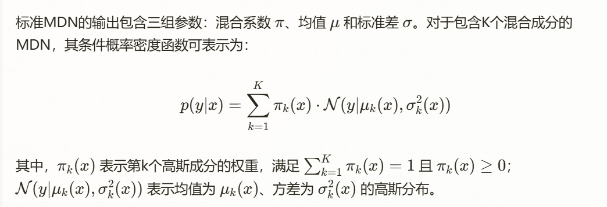

##### 信道空闲时隙预测问题
###### 多峰分布特性分析
在实际无线网络环境中，网络负载呈现出显著的多峰分布特性，这主要源于一天中不同时段的用户活动模式差异。为了验证这一现象，我们分析了多个公开的无线网络数据集，特别是具有代表性的WSS24数据集，该数据集包含了机场和实验室场景的RSSI（接收信号强度指示）测量数据。分析结果表明，RSSI信号强度在不同场景中呈现出显著的分布差异，图XX展示了不同场地和不同信道下RSSI分布统计图的四种典型场景：单峰、双峰、多峰以及不规则分布。
这种网络负载的多峰特性直接影响信道空闲时隙的分布特性。基于此观察，我们提出了双均值混合密度网络（DM-MDN），通过组合多个高斯分布来有效拟合这类多峰数据分布。

##### 双均值混合密度网络(DM-MDN)模型设计
###### 混合密度网络概述
混合密度网络(Mixture Density Network, MDN)是一种能有效建模多峰分布数据的神经网络结构。传统神经网络在回归任务中通常假设目标变量服从单一分布，这在处理多峰数据时显著受限。MDN通过组合多个概率分布来逼近复杂的条件概率密度函数，从而更准确地描述输出变量的不确定性和多模态特性。
MDN的核心在于将神经网络输出转化为定义混合概率分布的参数集，而非直接的预测值。这使网络能够学习输入与输出之间的多对多关系，突破了传统回归模型中多对一关系的局限。
标准MDN的输出包含三组参数：混合系数 π、均值 μ 和标准差 σ。对于包含K个混合成分的MDN，其条件概率密度函数可表示为：
xxxxxxxxxx

注意要加上每个值的限制
###### 预测任务中的混合密度网络用法
在预测任务中，MDN（混合密度网络）与传统神经网络有显著不同。MDN不直接输出预测值，而是输出定义混合分布的参数集。在实际应用中，常见的做法是对混合系数 $\pi$ 进行 softmax 处理，以确定最具代表性的分布成分，然后使用该成分的均值和标准差进行一次采用作为最终预测值。具体步骤如下：
确定权重最大的高斯成分 $k^* = \arg\max_k \pi_k(x)$；
使用选定成分的均值作为预测值 $\hat{y} = \mathcal{N}(\mu_{k^}(x), \sigma_{k^}^2(x))$。
这种方法本质上是通过隐式分类确定负载状态，再在识别出的负载类型下进行具体预测。例如，在无线网络环境中，不同的混合成分可能对应于不同的网络负载状态（如低负载、中负载、高负载）。模型首先识别最可能的负载状态，然后再给出当前负载状态下的信道空闲长度的均值和标准差。这种方法比先前的预测网络负载的研究更进一步，不仅识别网络负载状态，并且给出特定的区间。
然而，这种预测策略在实际应用中存在一个关键问题：由于高斯分布的特性，预测值的取值范围大概率(约99.7%)为：$(\mu_{k^} - \sigma_{k^}, \mu_{k^} + \sigma_{k^})$。尤其是在采样过程中，可能会产生明显大于均值的预测结果。在无线网络的信道接入场景中，这种“过度乐观”的预测可能导致节点错误认为有足够时间发送数据包，从而增加碰撞风险，最终降低网络性能。
##### 双均值混合密度网络(DM-MDN)模型设计
为解决“过度乐观”这一问题，本研究提出了双均值混合密度网络(DM-MDN)，通过结构化的均值分解机制，实现了在保持预测准确性的同时有效控制预测乐观度的目标。
###### 双均值机制具体设计
DM-MDN的核心创新在于将MDN中的单一均值参数 μk​ 分解为两个相互关联的组件：基础均值 μbase​ 和相对偏移 μoffset,k​。在模型训练阶段，两者共同构成完整的均值表示： XXXXXXXX
这里要再介绍一下 MDN的损失函数

\subsection{3.4.2 双均值机制的数学表达}

DM-MDN的核心创新在于将传统MDN中的单一均值参数$\mu_k$分解为两个相互关联的组件：基准均值$\mu_{\text{base},k}$和相对偏移$\mu_{\text{offset},k}$。在模型训练阶段，两者共同构成整个均值的完整表达式：

\[
\mu_k(x) = \mu_{\text{base},k}(x) + \mu_{\text{offset},k}(x)
\]

为了确保$\mu_{\text{base},k}$和$\mu_{\text{offset},k}$在$\mu_k(x)$中保持合理的比例关系，需要引入先验均值机制。具体而言，先设定一个先验参考值$\mu_{\text{prior},k}$：

\[
\mu_{\text{prior},k} = \mu_{\text{base},k} \cdot \frac{1}{(1 - a)} \cdot 10
\]

其中，$a \in (0,1)$为超参数，表示理想情况下$\mu_{\text{base},k}$应占总均值的(1-$a$)*100\%，而$\mu_{\text{offset},k}$贡献剩余的$a$*100\%。在训练过程中，我们通过将$\mu_{\text{offset},k}$与$\mu_{\text{prior},k}$之间的L2正则项加入到损失总损失函数L_{\text{total}}中，引导模型学习这种特定的结构化分解。

完整的损失函数可表示为：

\[
L_{\text{total}} = L_{\text{NLL}} + \lambda \cdot \sum_{k=1}^{K} \|\mu_{\text{offset},k} - \mu_{\text{prior},k}\|_2^2
\]

其中 L_{\text{NLL}} 是混合密度网络主体的损失函数

再介绍一下整体的网络结构图

图x为DM-MDN的模型结构图，主干神经网络向后分出4个分支，每个分支分别输出K个高斯成分的权重、均值和标准差。而普通的MDN只有3个分支，并没有将均值结构分解。

DM-MDN在训练与推理阶段对于均值的使用存在明显的差异化策略：
训练阶段：使用完整的均值 μbase,k+μoffset,k 拟合真实数据分布见公式(A)，确保模型能够准确捕捉数据的统计特性。
推理阶段：舍弃 μoffset,k部分，仅使用基础均值 μbase,k用于正太分布预测输出见公式(A)，从而实现预测结果的适度保守性。
这种非对称设计巧妙地解决了预测准确性与应用安全性的矛盾。与简单地对预测值应用固定缩放系数不同，虽然超参数a是提前设定好的，但DM-MDN通模型在训练的过程中，既要满足预测的准确度又要满足先验损失，模型会在这两者之间平衡使其能够在已有设定好的超参下细微调整。

##### 预测算法在信道接入中的应用   这里可以写一个算法1
在网络中，每个节点独立运行DM-MDN算法，节点会持续监听信道状态，记录历史信道空闲时隙长度。DM-MDN算法会根据历史信息去预测未来信道空闲时隙长度 Li。如图三所示，可以将数据包到达时机大致分为三种情况，对于情况1节点需等待信道空闲后再进行判断是否发送数据包，情况2节点可以直接发送数据包，情况3当数据包到达的时间不在预测的信道空闲时段内则需要等待下一个信道空闲时段。
这一算法允许节点在预测的信道可用窗口内直接发送数据包，省略了CSMA/CA协议中的间隔帧和二进制指数退避等等待机制，从而提高单个节点的信道接入效率。结合DM-MDN的保守预测特性，该算法在提升信道利用率的同时，有效控制了传输碰撞的风险。

##### 分位数
<!-- 混合密度网络(MDN)在网络预测任务中的关键优势在于能够捕捉多峰分布特性，并基于当前网络状态提供概率化预测结果。传统预测方法通常简单地采用具有最大权重的高斯成分的均值和标准差进行一次采样，作为最终预测值。然而，这种随机采样虽然符合网络负载情况，但难以满足不同节点的差异化需求。为解决此问题，本研究提出了基于分位数调整的差异化接入策略，显著增强了DM-MDN模型在实际应用中的灵活性与适应性。 -->
为了进一步增强DM-MDN的灵活性和适应性，本研究引入了基于分位数调整的采样策略，替代了传统的高斯一次采样方式，以更好地满足不同节点的需求。分位数在概率统计中表示分布中特定百分比位置的值。对于高斯分布，不同分位数对应于距离均值特定标准差倍数的位置。例如，50%分位数对应于分布均值，而95%分位数则位于均值上方约1.645倍标准差处。
在DM-MDN预测框架中，我们引入分位数参数q∈[0,1]，使预测系统能够基于选定的高斯成分(k*)，根据指定分位数生成预测值
\hat{L}_i = \mu_{\text{base},k^*} + \Phi^{-1}(q) \cdot \sigma_{k^*}
其中，XX表示标准正态分布的逆累积分布函数在q处的值。此机制使预测系统能够在相同网络状态下，根据节点的具体需求提供从保守到激进的差异化预测值。
分位数调整实质上改变了节点对信道空闲时长的预期，直接影响其接入决策。具体而言：高分位数设置生成较为乐观的预测值，使节点预期有更长的信道空闲时间，从而采取更激进的发送策略；低分位数设置则生成相对保守的预测值，使节点预期信道空闲时间较短，采取更谨慎的发送策略。通过调整分位数参数，网络管理者或自适应算法可为不同节点分配差异化的信道接入能力，实现网络资源的精细化分配与管理。
