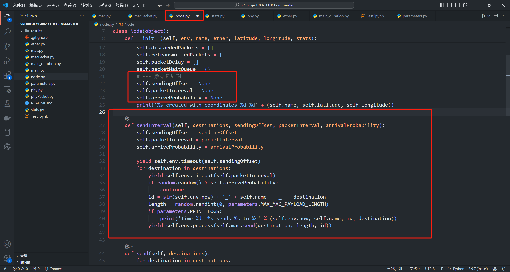

#### 1. 增加超时丢弃的设计
##### 1.1 超过最大重传次数丢弃数据包
- 添加位置见下图：

##### 添加超过截止日期丢弃
- 添加字段：

- 在MAC层添加超时丢弃：

#### 2. 增添性能指标 Node 数据结构设计
##### 应该主要包含：丢包、时延、重传等信息
- 每个结点的丢包情况
    - 在 Node 结点中添加一个丢包记录的数组
        - 数组内的数据是 macPkt.id
    
    
    
- 每个结点的重传情况
    - 在 Node 结点中添加一个重传记录的数组。
        - 数组内的数据类型是字典 retransmit_count
    
    
- 每个数据包的时延情况
    - 方案一：ACK数据包携带时延信息
        - 修改 在Node结点中添加数据包时延字段数组。存储的是：delay_time
        
        - 修改 macPacket 类，添加三个字段：数据包生成时间、数据包发送时间、数据包接收时间
        
        
        
        - 修改 在接收数据包时，如果是 ACK 数据包，增加处理流程，计算时延
        
        - 时延 = 数据包接收时间 - 数据包生成时间 - 数据包发送时间、
    - 方案二：开启上帝视角
        - 接收端在收到数据包之后直接将时延写入到发送端的Node结点中。
        - 修改：Node结点中添加一个时延记录的数组、macPacket添加一个 数据包生成时间

#### 3. Node结点数据队列
- 初始化一个队列数据结构，用于存储数据包信息(长度等)

- 记录数据包信息。{macPkt.id, duration}

- 在数据包成功发送时或超时次数过多时，将队头数据包删除
    - 超过最大重传次数删除
    
- 注：在目前的仿真中，最长的数据包队列长度为2，以上的实现只实现了记录数据包情况

#### 4. 增加 Duration/ID 字段
- 该字段一共2B大小。在用于Duration时，最后一位为0，因此用于表示传输时间的位数为0-14，单位为微秒。
- 计算一个数据包的持续时间，需要考虑：
    - 数据帧长度、MAC层开销、物理层开销、数据传输速率、间隔帧(SIFS、DIFS)、ACK帧时长
    - 理论值：
- 真实测试结果：65668 
- 添加方案：
    - 在 macPacket 类中添加一个字段：duration
    
    
    - 计算duration字段内容：
        - 由于MAC层数据包要发送时，需要等待一个 DIFS 时间(详见图24-25)
        - 因此 Duration 应该要减去一个 DIFS 时间
    
    
    

#### 5. 实现多跳

#### 6. 实现时隙繁忙/空闲统计
##### 1 统计繁忙时间
- 繁忙时间统计方法：数据包交给物理层起算，截至到接收到ACK数据包
- 统计数据结构：
    - 字典：{macPkt.id, [start, end, theory_duration]}

- 开始时间：

- 截止时间：

- 理论持续时间：

- 超时删除：

- 补丁：之前的方案，对于超时数据包，重传的时候并不会记录其截止时间，并且下次重传的时候会覆盖掉之前的开始时间。以下为一个补丁：
    - 首先拿出开始时间、创建新ID、计算并添加信道繁忙时间、最后添加理论时间
    - 注意：截至时间要剪掉一个 ACK 超时时间，加上一个 Duration。
    - 不这样处理会出现以下状况：
        - 前一个数据包 [T1, T1 + ACK_TIMEOUT] 和后一个数据包 [T2, xxx]
        - 假设 T1 是 ACK 超时数据包，有可能会导致 T2 < T1 + ACK_TIMEOUT
    
##### 2 绘制繁忙空闲时间轴数组
- 朴素方案

- 优化方案：
    - 1. 可以将时隙的单位从纳秒改为微秒
    - 2. 数据处理：
        - 处理数据格式 [theory_duration, real_duration, next_busy_time]
        - theory_duration: 理论持续时间
        - real_duration: 实际持续时间
        - is_retransimission: 是否为重传数据包   值为：1/0
        - next_busy_time: 下一个繁忙时间时隙。以上一个繁忙时隙为起点的相对时隙。
    - 注意：如果前一个数据包发送过程中后一个数据包开始发送，就会导致next_busy_time算出来为负数。将负数置为0即可。
    

#### 7. 实现周期数据包到达模式
##### 1 设计
- 参数：起始时间(offset)、到达周期(interval)、到达概率(probability)
    - 起始时间：0-3000000 中的随机值
    - 到达周期：150000-400000
        - 该仿真软件中，一个数据包的大小是在一个区间内的随机值。
        - 最小数据包的传输时间加上ACK帧时间大约在 70000
        - 最大数据包的传输时间加上ACK帧时间大约在 420000
        - 对于只有一个结点发送数据进行模拟信道情况，建议采用150000-200000，这样可以导致适当的重传
        - 对于对各结点，建议每个结点采用300000-400000。这样不会导致严重的碰撞
    - 到达概率：0.7-0.99
##### 2 实现
- 在 Node 类中添加三个属性，以及一个发送函数

#### 8. 实现决策发送
##### 1. 根据预测结果发送数据包 
- 信道信息字典：{macPkt.id, [start, end, theory_duration]}
    - 处理字典信息：根据start进行排序、提取出 Sequence_length 长度的空闲信息
- 判断是否采取预测：
    - 当还存在 value 字段列表长度不为3时，说明信道处于繁忙状态
    - 反之空闲
- 根据排序后的最后一个列表进行判断是否进行发送
    - 计算当前时间距离上一个数据包发送结束时间间隔 gap = env.now - end 
    - 如果 predict_time > gap 可以选择发送，反之不选择发送
    - 在可以发送的阶段，需要短暂暂停，避免信道中还有剩余数据包未发送完成。
        - 暂停时间：20000
 

#### 99. 注意一些细节：
##### 1.同一结点的不同数据包的发送间隔相关问题
- 有关发送间隔。如下图。
    - 如果要保证同一个结点两个连续的数据包不会相互影响。(就是，前一个数据包比较大，发发送时间比较长，导致后一个数据包需要等待，从而增大延迟)
    - 需要将25行的等待设置 >= 420000

- 原因：见下图
    - 上图第30行虽然是 yeild ，但是它并不是等待一个完整的发送过程结束。
    - 观察MAC层发现，在下图函数中，红框中，并没有 yield。也就是说，物理层的发送、等待ACK这两个操作都不需要MAC层等待。而是直接 Return。回到了上图的第30行，然后进行下一轮循环。

- 400000的由来：
    - 如下图，套入公式：
    length = random.randint(0, parameters.MAX_MAC_PAYLOAD_LENGTH)
    duration = macPkt.length * parameters.BIT_TRANSMISSION_TIME + parameters.PHY_HEADER_LENGTH
    - 最大值大约在 400000-420000 之间

##### 2. 两个结点最大物理距离间隔
- 31