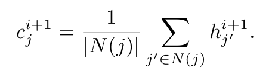
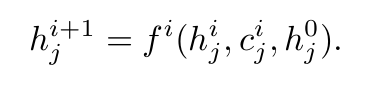

02-无约束通信-Learning multiagent communication with backpropagation.pdf

- 如图所示，这个方法是一种全通信方法，通信是在模型网络的没两层中间发生。
- 这个图从右向左看
    - 最右每个灰色块的竖列是指一个智能体。每层代表这些智能体神经网络的层数
    - 中间图片是指两层中发生的通信的示意图
- 通信：
    - 蓝色输出的h表示神经网络每层正常的输出，然后输入到下一层
    - 所有智能体蓝色的输出h经过加起来后的平均作为通信内容
    - 将mean输入到下一层，即红线部分的c
    - 整体就是神经网络的层间通信

- c 和 h 的公式：

