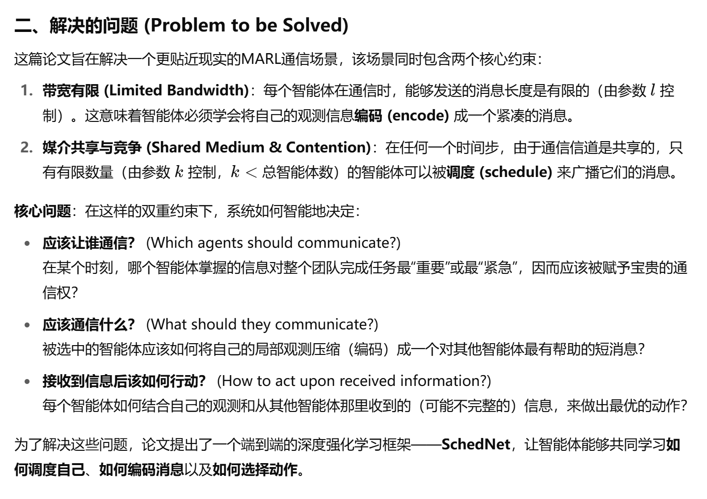
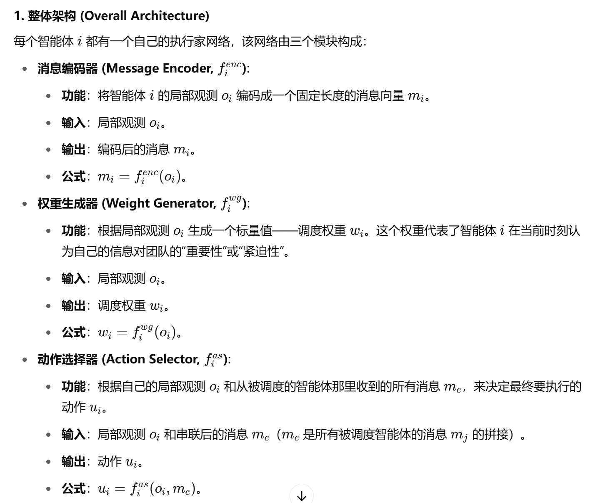
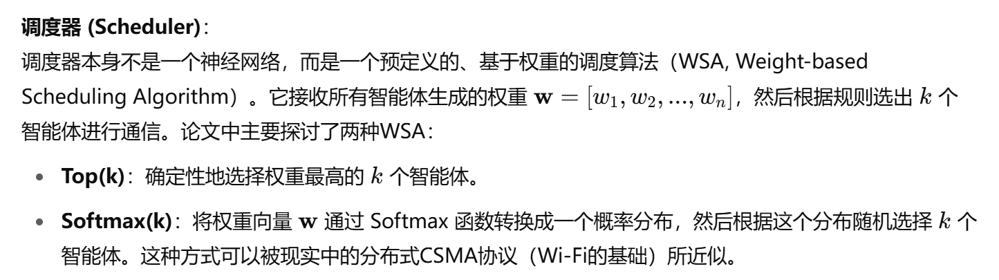
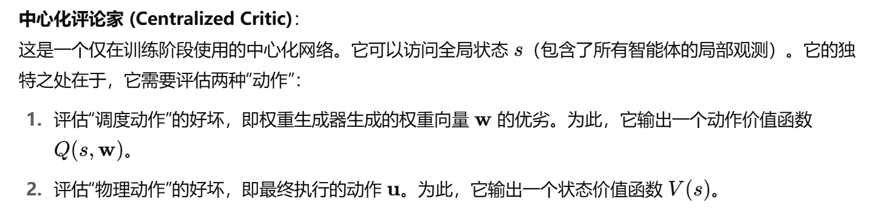
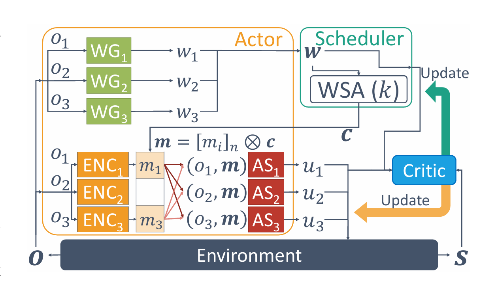
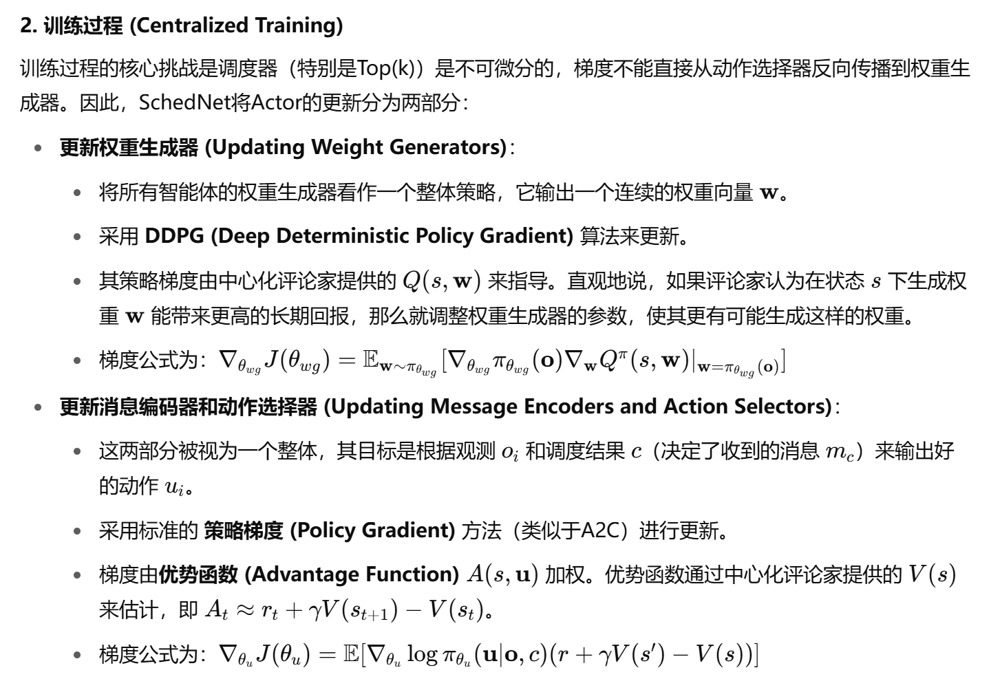

##### 之前研究的局限性
- 在SchedNet之前，虽然有研究工作（如DIAL）考虑了MARL中的通信问题，但它们主要关注带宽有限 (limited bandwidth) 的约束。也就是说，它们研究如何让智能体学会发送简短但信息量丰富的消息。然而，这些工作很大程度上忽略了另一个在无线通信中非常普遍且关键的现实问题：共享媒介的竞争

##### 解决的问题

##### 方法设计
- https://github.com/rhoowd/schednet
- 三个部件的作用：

- 调度器

- Critic

- 整体结构图

- 各个部件的训练过程
