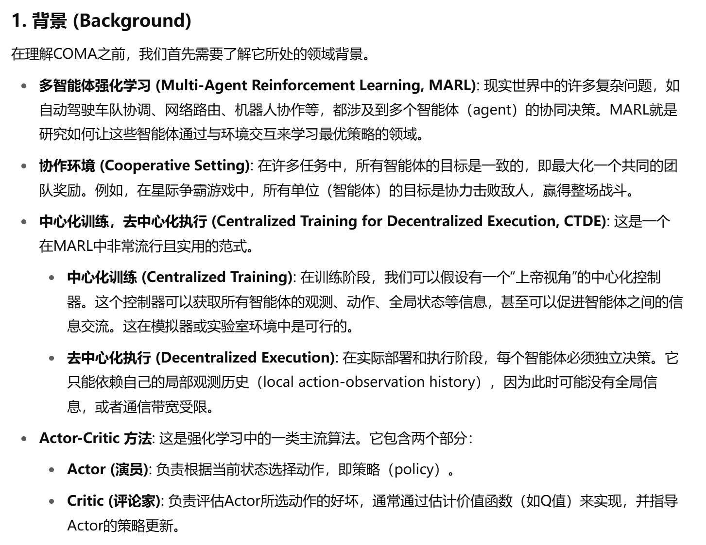
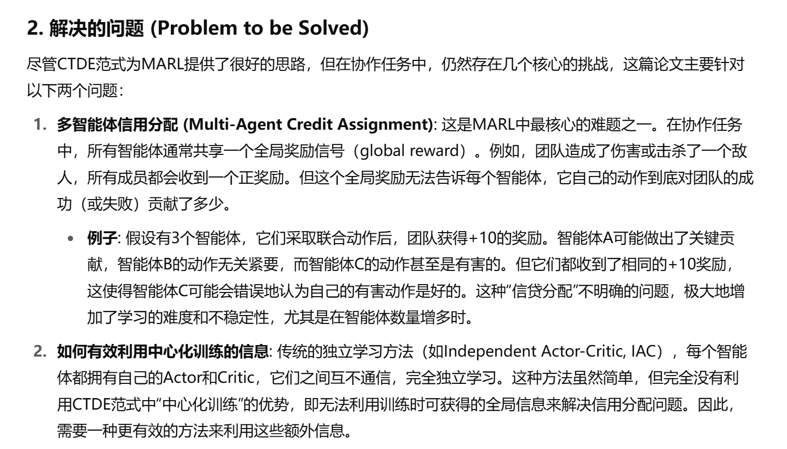
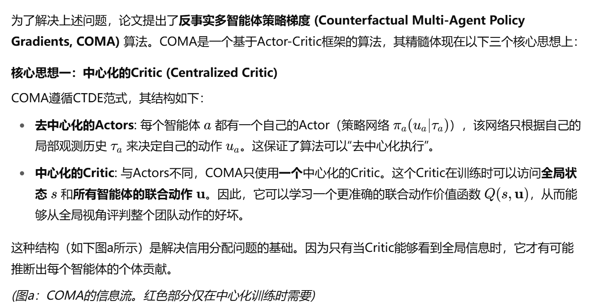
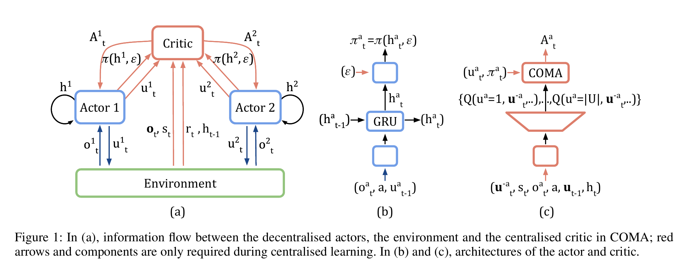
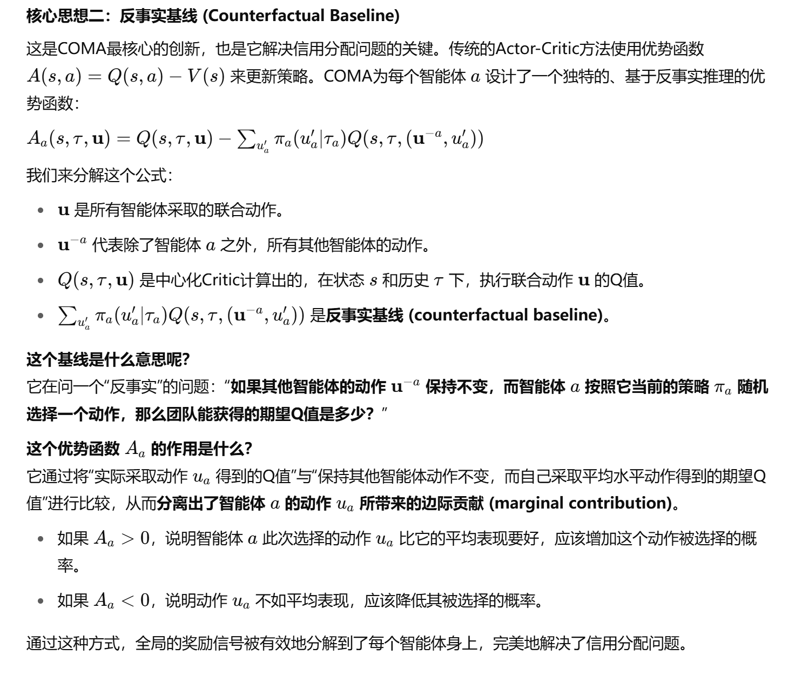
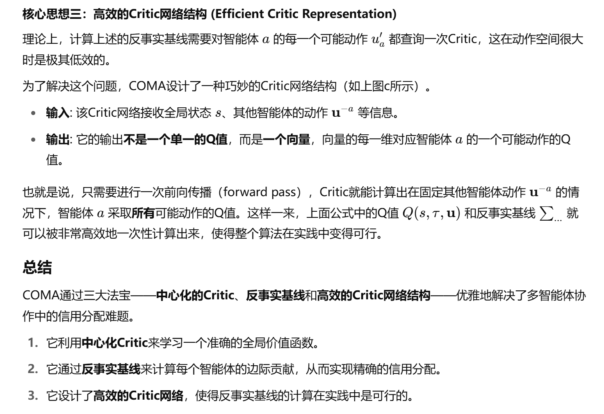

##### 背景

##### 解决的问题

##### 方法设计
- 核心思想

- 整体结构图

- 反事实基线设计
    - 解释：u就是所有智能体的联合动作，为了测试出a智能体当前所采取的u_a的整体贡献，公式的后半部分就是遍历a智能体的其他动作u`_a，分别计算出采取其他动作时的Q并乘上这个动作的选择概率。这样就可以计算出在采用动作u_a和不采用动作u_a时的Q的差值。从而计算出u_a对整体的贡献，或者说u_a的好坏。

- Critic网络
